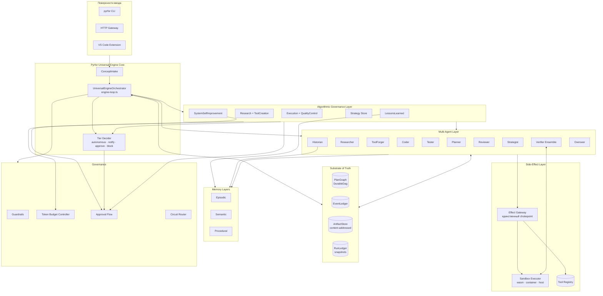
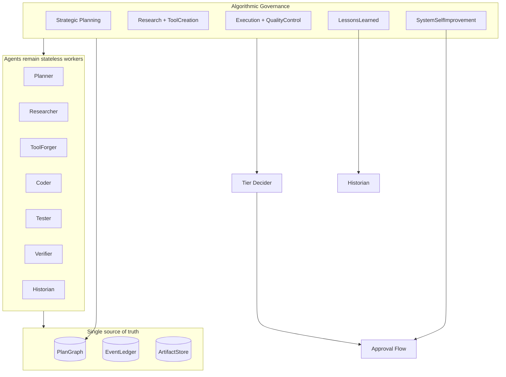

# 02 — Архитектура

> ← [01 — Strategy & Goals](strategy-and-goals) · далее → [03 — Lifecycle](lifecycle)

---

## 2.1 Высокоуровневая схема

---

## 2.2 Algorithmic Governance Layer

> Подробно: [00.5 — Algorithmic Governance](00.5-algorithmic-governance)

Algorithmic Governance — это **meta-layer над Multi-Agent Topology**, а не новый агент и не новый оркестратор. Он определяет, какой управляющий алгоритм применяется к фазе, какие checkpoint'ы обязательны, какие feedback loops разрешены и когда действие должно перейти в `notify`, `approve` или `block`.

Consequential PlanGraph nodes получают governance contract:

- `governedByAlgorithm`;
- `checkpointPolicy`;
- `completionCriteria`;
- `feedbackPolicy`;
- `budgetProfile`;
- `bottleneckHypothesis`;
- `lessonSink`.

Эти поля усиливают существующий `DurableDag`: алгоритмы управляют порядком и критериями, но аудит, артефакты и статусы по-прежнему живут только в `PlanGraph` / `EventLedger` / `ArtifactStore`.

---

## 2.3 Маппинг на существующие примитивы Pyrfor

> Принцип: **расширяем, не дублируем**. Никаких параллельных ledger'ов / dag'ов / artifact-store'ов.

### Расширяемые модули

| Существующий файл | Что добавляем |
|---|---|
| `runtime/run-lifecycle.ts` | `RunMode='universal'`, `parent_concept_id`, `engine_phase` |
| `runtime/event-ledger.ts` | События `concept.*`, `tool.forge.*`, `extension.*`, `research.*`, `critique.*`, `strategy.*`, `effect.*` |
| `runtime/durable-dag.ts` | Новые `kind`'ы узлов: `ue.plan`, `ue.research`, `ue.tool_forge`, `ue.execute`, `ue.critique`, `ue.memory_persist`, `ue.sandbox_run`, `ue.test_synthesis`, `ue.delivery`, `ue.postmortem`; governance поля `governedByAlgorithm`, `checkpointPolicy`, `completionCriteria`, `feedbackPolicy`, `budgetProfile` |
| `runtime/artifact-model.ts` | Новые `ArtifactKind`'ы (см. ниже) |
| `runtime/verifier-lane.ts` | Поддержка ensemble (≥2 независимых верификатора + family-diversity rule + quorum) |
| `runtime/approval-flow.ts` | Поля `concept_id`, `engine_phase`, `governance_context`; интеграция с context-aware Tier Decider |
| `runtime/guardrails.ts` | Новый tier `'sandbox'` между `review` и `restricted`; `sandboxBackend` в context |
| `runtime/token-budget-controller.ts` | `BudgetScope='concept'`, per-phase/per-algorithm атрибуция, per-tool caps |
| `runtime/pyrfor-fc-circuit-router.ts` | Без изменений — переиспользуем для multi-model failover |
| `runtime/pyrfor-fc-skill-writer.ts` | Поля `version`, `toolKind`; метод `delete()` |
| `runtime/gateway.ts` | Новые HTTP endpoint'ы (см. [09](api-cli-vscode)) |
| `runtime/cli.ts` | Новые режимы `concept`, `plan`, `run`, `tool`, `status` |

### Новые модули `packages/engine/src/runtime/universal/`

| Файл | Контракт |
|---|---|
| `types.ts` | Все shared TS-интерфейсы Universal Engine. Чистые типы. |
| `engine-loop.ts` | **UniversalEngineOrchestrator** — Main Loop, последовательность фаз, `dispatchConcept()`, идемпотентный restart |
| `planner.ts` | **UniversalPlanner** — concept → PlanGraph, gap analysis, replanning |
| `researcher.ts` | **UniversalResearcher** — внешний/внутренний поиск с провенансом и injection-scan |
| `tool-forge.ts` | **ToolForge** — manifest-first синтез: spec → manifest → impl → static taint → dynamic dry-run → tests → promotion |
| `tool-registry.ts` | **ToolRegistry** — append-only JSONL, dedup по contentHash |
| `sandbox-executor.ts` | **SandboxExecutor** + `ISandboxExecutor` интерфейс |
| `effect-gateway.ts` | Единственный chokepoint для всех side effects (fs/net/process) |
| `tier-decider.ts` | Pure function: action → `autonomous | notify | approve | block` |
| `critic.ts` | Verifier ensemble facade: оркестрация ≥2 независимых верификаторов |
| `memory/memory-facade.ts` | Унифицированный read-path над `memory-store.ts` |
| `memory/strategy-store.ts` | Approved-only CRUD над strategic memory |
| `self-extension-loop.ts` | Итерация по `missingTools`, обработка `extension.tool_blocked` |
| `memory/concept-store.ts` | Concept/project memory поверх существующего `MemoryStore` |
| `historian.ts` | Postmortem + memory writes с провенансом |
| `index.ts` | Barrel re-export |

### Новые отдельные пакеты

| Пакет | Зачем | Зависимости |
|---|---|---|
| `packages/sandbox` | Docker / Wasm / Firecracker-shaped backends. Чтобы `engine` не имел hard-dep на `dockerode`. Загружается через dynamic `import()`. | `dockerode`, `wasmtime`/`wasmer` |
| `packages/cli` | Standalone бинарник `pyrfor`. Тонкий HTTP-клиент над gateway. | `commander`, тип-only `engine` |

---

## 2.4 Новые ArtifactKind'ы

| kind | Content-Type | Retention |
|---|---|---|
| `concept_record` | `application/json` | permanent |
| `clarification_transcript` | `application/json` | 90 дней |
| `research_result` | `application/json` | 90 дней |
| `plan_document` | `application/json` | permanent |
| `capability_gap_report` | `application/json` | 90 дней |
| `tool_discovery_report` | `application/json` | 90 дней |
| `tool_capability_manifest` | `application/json` | permanent |
| `tool_source` | `text/plain` | permanent |
| `tool_test_suite` | `application/json` | permanent |
| `sandbox_result` | `application/json` | 30 дней |
| `effect_journal` | `application/jsonl` | permanent |
| `execution_result` | `application/json` | permanent |
| `acceptance_test_suite` | `application/json` | permanent |
| `verification_report` | `application/json` | 90 дней |
| `critique_report` | `application/json` | 90 дней |
| `delivery_bundle` | `application/zip` | permanent |
| `postmortem_report` | `application/json` | permanent |
| `lessons_learned` | `application/json` | permanent |
| `algorithm_outcome` | `application/json` | 90 дней |
| `bottleneck_report` | `application/json` | 90 дней |
| `governance_adjustment_proposal` | `application/json` | permanent |
| `strategy_snapshot` | `application/json` | permanent |
| `concept_trace` | `application/json` | 90 дней |

---

## 2.5 Дисциплина «нет параллельных структур»

Любое предложение, которое:

- создаёт собственный append-only log вместо EventLedger,
- создаёт собственный планировщик/DAG вместо `DurableDag`,
- хранит артефакты вне ArtifactStore,
- организует приватный канал общения между агентами в обход EventLedger / PlanGraph,
- создаёт "алгоритмический совет" или governance-memory вне PlanGraph/EventLedger,

— должно отвергаться при code review. Universal Engine выигрывает за счёт **одной** правды и **одной** аудит-цепочки.
