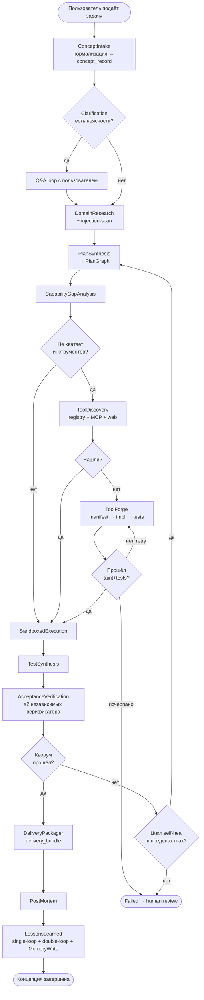
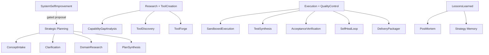
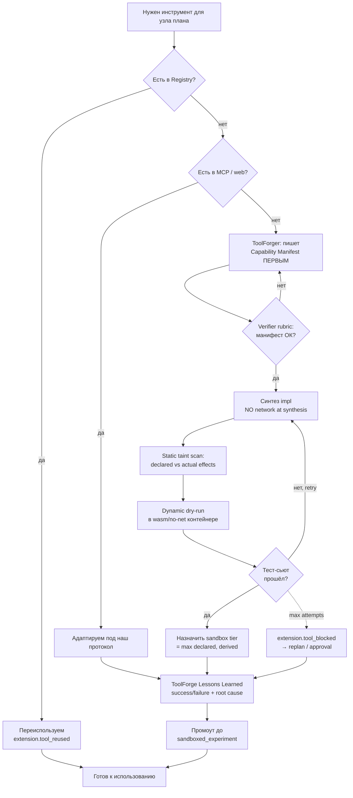
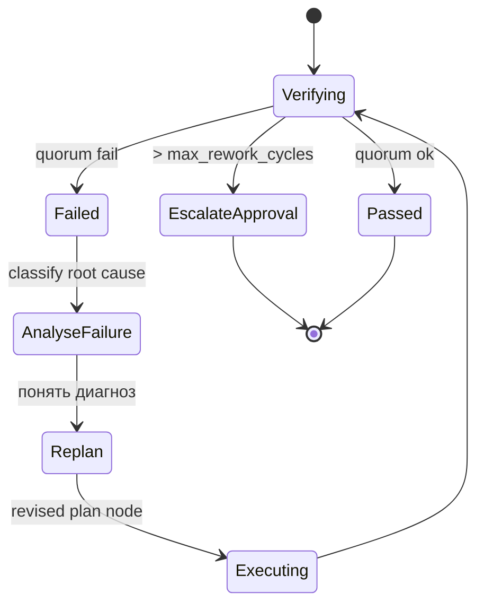

# 03 — Жизненный цикл концепции

> ← [02 — Architecture](architecture) · далее → [04 — Multi-Agent Topology](multi-agent-topology)

---

## 3.1 Полный поток

---

## 3.2 Алгоритмическая карта фаз

**Дисциплина фаз (governing algorithm + completion gate + max loops):**

| Фаза | Governing Algorithm | Required Checkpoints | Max Loops | Stop / Escalation | Double-Loop Trigger |
|---|---|---|---|---|---|
| `Research + Gap` | `Research + ToolCreation` (TOC) | `bottleneck_proof`, `capability_gap_report`, `tool_discovery_report` | 3 | budget exhausted **или** no new evidence | `no_vetted_solution_found` |
| `ToolForge` | `Research + ToolCreation` (TOC) | `bottleneck_proof`, `tool_capability_manifest`, `taint_clean`, `tests_passed`, `lessons_learned(scope=tool)` | 2 | `toolforge_cycle_report` + escalation | `forge_failed_twice` |
| `Execute + Test` | `Execution + QualityControl` | `execution_result`, `acceptance_test_suite`, `verification_report` | 3 (actionable failure-классы) | verifier_disagreement / external_dependency используют отдельный `verifierRetryBudget` | `verification_failed` |
| `PostMortem` | `LessonsLearned` | `postmortem_report`, `root_cause_report` | 1 | `postmortem_report` обязателен | `systemic_defect_detected` |
| `LessonsLearned` | `LessonsLearned` | `lessons_learned`, `algorithm_outcome`, `governance_adjustment_proposal?` | 1 | proposal — автономно, активация — через `ApprovalFlow` | `governance_adjustment_required` |

`LessonsLearned` — отдельный обязательный шаг после `PostMortem`, а не вложенная часть `PostMortem`.

---

## 3.3 Контракты фаз

| Фаза | Управляющий алгоритм | Входы | Артефакты | Верификатор(ы) / checkpoint |
|---|---|---|---|---|
| **ConceptIntake** | Strategic Planning | сырой запрос пользователя | `concept_record`, нормализованная цель | schema validator; unsafe intent → block |
| **Clarification** | Strategic Planning | `concept_record`, strategy memory | `clarification_transcript`, уточнённая цель | LLM rubric + user signoff в interactive режиме; unresolved assumptions ≤ threshold |
| **DomainResearch** | Strategic Planning / Research + ToolCreation | уточнённая цель | `research_result` с source provenance | source-quality rubric + injection-scan; OODA re-orient max 2 loops без нового evidence |
| **PlanSynthesis** | Strategic Planning | цель + research + strategy | `plan_document` (PlanGraph spec), `budget_profile`, `completion_criteria` | plan-rubric LLM + dry-run feasibility |
| **CapabilityGapAnalysis** | Research + ToolCreation | plan, ToolRegistry | `capability_gap_report`, `bottleneck_report` | детерминированный registry diff; один главный bottleneck per cycle |
| **ToolDiscovery** | Research + ToolCreation | gap report | `tool_discovery_report` | registry/MCP/web availability checks; reuse/adapt перед forge |
| **ToolForge** | Research + ToolCreation | спецификация недостающего инструмента, `bottleneck_proof`, `reuse_analysis` | `tool_capability_manifest`, `tool_source`, `tool_test_suite`, `RegistryEntry`, `lessons_learned`, `toolforge_cycle_report` | TOC-Gate (4 артефакта) + static/dynamic taint + sandbox dry-run + test suite; max 2 ToolForge цикла; max 2 новых executable non-adapter tools per `concept_run` |
| **SandboxedExecution** | Execution + QualityControl | plan node, tool refs | `execution_result`, `effect_journal` | exit-code + effect-bounds + budget |
| **TestSynthesis** | Execution + QualityControl | spec + execution_result | `acceptance_test_suite` | suite-shape rubric + executable run |
| **AcceptanceVerification** | Execution + QualityControl | execution_result + tests | `verification_report`, `failure_classification` | **ensemble: ≥2 независимых verifier'а** (executable + LLM-judge) |
| **SelfHealLoop** | Execution + QualityControl | failed verification | revised plan/tool/exec | bounded by `max_rework_cycles` (default 2); failure root cause classified |
| **DeliveryPackager** | Execution + QualityControl | passing artifacts | `delivery_bundle` | manifest+checksum verifier |
| **PostMortem** | LessonsLearned | full run history | `postmortem_report`, `root_cause_report` | meta-critic; фиксирует single-loop диагноз, но не заменяет `LessonsLearned` |
| **LessonsLearned** | LessonsLearned | postmortem + tool/run outcomes | `lessons_learned`, `algorithm_outcome`, `governance_adjustment_proposal?` | single-loop обязателен; double-loop proposal автономно, активация — через `ApprovalFlow` |

---

## 3.4 Self-Extension Loop (создание инструментов)

**Жёсткий порядок ToolForge:**
1. Spec → Manifest *(сначала декларируем эффекты)*.
2. Verifier-review манифеста.
3. Impl — **без сетевых инструментов** во время синтеза.
4. Static taint (AST-level): сравниваем declared effects с фактическими.
5. Dynamic dry-run в самом ограниченном tier'е.
6. Test-suite execution.
7. Sandbox tier = max(declared, derived-from-effects).
8. **Lessons Learned artifact**: что сработало, что провалилось, root cause, evidenceRefs, tool/policy delta.
9. Промоут только в `sandboxed_experiment`. Выше — через runs+verifiers+human approval.
10. Eviction по failure-score EMA.

**Theory of Constraints rule:** ToolForge запускается только если главный bottleneck подтверждён и не снимается `reuse` / `adapt` / изменением плана. Это предотвращает создание инструментов «про запас».

---

## 3.5 Self-Heal Loop (при провале верификации)

- `max_rework_cycles` по умолчанию 2 (конфигурируемо).
- Каждая итерация — новые узлы PlanGraph (immutable), не мутируем старые.
- Каждый failure классифицируется как `spec_gap`, `tool_gap`, `execution_bug`, `test_gap`, `verifier_disagreement`, `budget_or_tier` или `external_dependency`.
- Self-heal без нового evidence не повторяет тот же action; он обязан изменить plan/tool/test или эскалировать.
- При исчерпании — `approval` запрос пользователю с полным failure_trace.

---

## 3.6 Resume и Rollback

- Snapshot `RunLedger` на границе каждой фазы.
- ArtifactStore content-addressed → артефакты неизменяемы.
- PlanGraph re-hydration из EventLedger → возможность возобновить с любого узла.
- Rollback = создать новый run, наследующий состояние до snapshot'а N, и продолжить.

---

## 3.7 Enforcement: Completion Gate Engine на границе фаз

Завершение любого узла идёт только через `UniversalEngineOrchestrator.completeNode()`, который перед transition обязан вызвать `CompletionGateEngine.evaluate()` (см. [00.5.8](00.5-algorithmic-governance#058-enforcement-completion-gate-engine)). Без `disposition ∈ {passed, waived_by_approval}` узел не переходит в `completed`.

**Admission vs completion.** В рамках одной фазы возможны **два** разных gate-события:

- **Admission gate** — проверяется перед `dag.node.started` (например, `TOC-Gate` для ToolForge).
- **Completion gate** — проверяется перед `dag.node.completed` (например, signed `tool_capability_manifest` + `taint_clean` + `tests_passed` + `toolforge_cycle_report` + PostForge LessonsLearned).

Эти события эмитятся независимо, имеют отдельные `gate_id`, отдельные счётчики `attempt` и могут проходить/проваливаться независимо.

**Retry на новой evidence.** Gate failure с `disposition='failed_retryable'` ставит узел в `awaiting_new_evidence`. Следующая попытка completion валидна **только** если `evidence_snapshot_hash` изменился (новые артефакты или approval). Идентичный snapshot → noop без новых событий. Это исключает permanent brick узла, который позже получит недостающие артефакты.

**Бюджет.** Сама проверка gate не списывает execution/self-heal budget. Уже выполненная работа узла не возвращается. Failure с `failed_terminal` требует ApprovalFlow или явного отказа узла.

**Replay.** `CompletionGateEngine.replay(events)` детерминированно реконструирует `GateReplayState` на каждый `(nodeId, gateId)` из EventLedger.

**Инвариант:**

> Нет `dag.node.completed` без предшествующего `governance.gate.checked` с `disposition ∈ {passed, waived_by_approval}` для соответствующего `gate_id` и текущего `attempt`.
