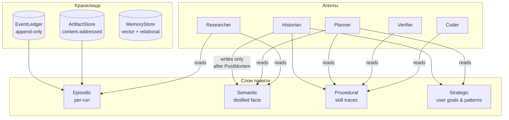
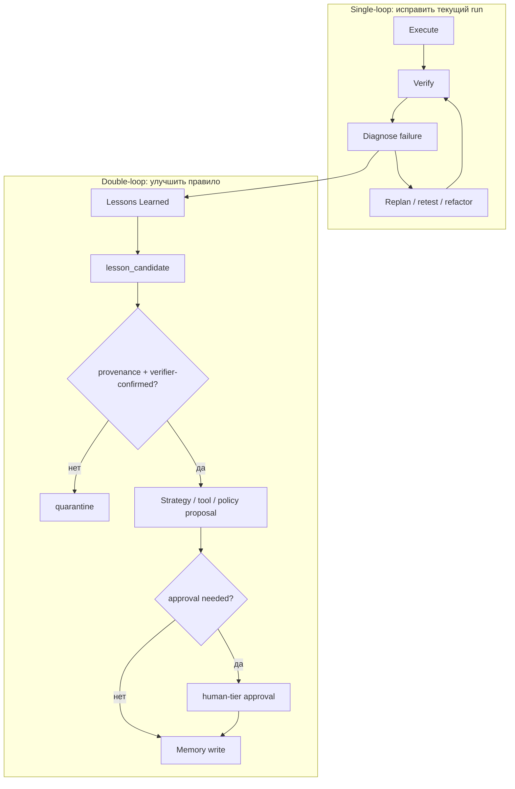
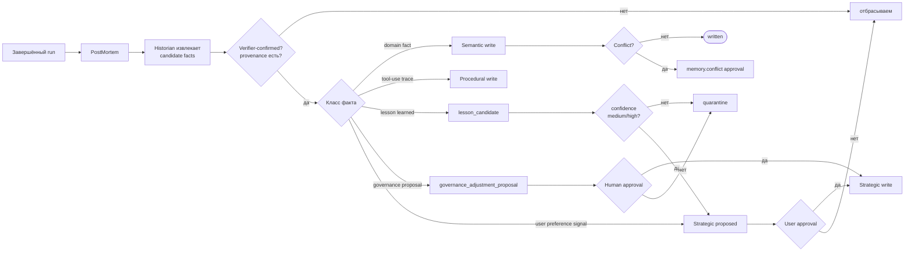

# 06 — Memory & Strategy

> ← [05 — Tool Model](tool-model) · далее → [07 — Safety & Governance](safety-and-governance)

---

## 6.1 Слои памяти



---

## 6.1.1 Memory Architecture v2 ownership

Memory v2 вводится поэтапно: в M1 — **контракты и минимальный Strategy prefetch**, в M2 — **read-path foundation**, полный `ContextEngine`/компрессоры/графы — позже, когда появится реальное давление контекста.

| Component | File | Owner | M1 scope |
|---|---|---|---|
| `MemoryProvider` lifecycle | `packages/engine/src/runtime/universal/memory/provider.ts` | Runtime memory layer | interface + types only |
| `StrategyMemoryProvider` | `packages/engine/src/runtime/universal/memory/strategy-memory-provider.ts` | Historian writes; Strategist/ToolForger read | `prefetch()` returns approved DoubleLoop / strategy lessons first |
| `AlgorithmAwareRetriever` | `packages/engine/src/runtime/universal/memory/algorithm-aware-retriever.ts` | Strategist/ToolForger | applicability-first retrieval by algorithm/phase/nodeKind/ruleKey |
| `ContextEngine` | `packages/engine/src/runtime/universal/memory/context-engine.ts` | Context assembly layer | compose existing `ContextCompiler`; M3 adds deterministic `TruncateBudgetCompressor` + `DeduplicateCompressor` |
| Shared lesson/provenance types | `packages/engine/src/runtime/universal/memory/types.ts` | Universal Engine contracts | `SingleLoopRecord`, `DoubleLoopRecord`, `LessonsQuery`, `LessonDecisionImpact` |
| `ConceptStore` | `packages/engine/src/runtime/universal/memory/concept-store.ts` | Memory read-path | cross-concept project memory via `MemoryStore` scopes (`concept:<id>`) |
| `StrategyStore` | `packages/engine/src/runtime/universal/memory/strategy-store.ts` | Strategic memory | approved-only strategy entries with project isolation (`kind='strategy'`, `scope='strategy'`) |
| `UniversalMemoryFacade` | `packages/engine/src/runtime/universal/memory/memory-facade.ts` | Memory read-path | approved-only retrieval across StrategyProvider + MemoryStore |
| Existing storage primitives | `memory-store.ts`, `ralph-lessons-store.ts`, `memory-wiki.ts`, `event-ledger.ts`, `artifact-model.ts` | Runtime substrate | reused; no parallel store |

**M2 read-path rules:**

1. `UniversalMemoryFacade.prefetch()` may read only **approved**, non-legacy, non-rejected, non-quarantined strategy/lesson entries.
2. `StrategyMemoryProvider` remains DoubleLoop-first, but early M2 uses it as read-path only; writeback/backfill stays gated for M13.
3. Cross-concept memory uses `ConceptStore` over the existing `MemoryStore` schema — no new database or parallel memory store.
4. Project scope is explicit via tags such as `project:<id>`; default behavior is no cross-project leakage.
5. Raw `LessonsLearnedArtifact` never goes directly to Planner/ToolForger; it must become approved/distilled memory first.

---

## 6.2 Описание слоёв

| Слой | Содержание | Backing | Retention | Кто пишет | Кто читает |
|---|---|---|---|---|---|
| **Episodic** | Все узлы PlanGraph + события + артефакты конкретного run'а | EventLedger + ArtifactStore | по runId | автоматически (engine) | Historian |
| **Semantic** | Дистиллированные факты («библиотека X требует Y», «endpoint Z возвращает W») | MemoryStore (vector + relational hybrid) | долгая | Historian (после PostMortem) | Planner, Researcher |
| **Procedural** | Успешные последовательности использования инструментов; Voyager-style skill library | ToolRegistry + saved plan fragments | долгая | Historian | Planner, Coder, Verifier |
| **Strategic** | Цели пользователя, предпочтения, «как мы обычно решаем X», результаты управляющих алгоритмов | MemoryStore (`kind='strategy'`) | permanent | Historian + явные user-команды | Planner (всегда), Strategist |

---

## 6.3 Политика записи

- **Только Historian** пишет в semantic / procedural / strategic — и только **после** PostMortem.
- Каждая запись несёт **provenance**: `artifactRefs[]` источников + `runId` + `nodeIds`.
- На противоречии с существующей записью Historian **не перезаписывает**, а открывает `memory.conflict` approval request.
- Strategic memory защищена дополнительно: изменение / удаление существующей стратегии — всегда human-tier approval.

---

## 6.4 Политика чтения

| Агент | Читает | Зачем |
|---|---|---|
| Planner | strategic + procedural + semantic | строить план под предпочтения пользователя и переиспользовать known-good паттерны |
| Researcher | semantic + episodic (за свой conceptId) | избегать повторных поисков, использовать prior-art |
| Verifier | procedural | знать известные pitfalls конкретного инструмента |
| Coder | procedural | следовать known-good вызовам инструмента |
| Strategist | strategic + episodic кросс-conceptId | советовать Planner |
| Historian | всё | пишет; читает для consolidation |
| Overseer | episodic текущих runs | мониторинг |

Episodic читается ТОЛЬКО Historian'ом и Overseer'ом (производительность + изоляция контекста).

---

## 6.5 Strategy Store

CRUD-структура для пользовательских стратегий.

```ts
interface StrategyEntry {
  key: string;                          // например, 'preference.test-framework'
  value: string;                        // 'vitest'
  domain?: string;                      // 'ts', 'python', 'general'
  rationale?: string;                   // почему пользователь так решил
  algorithmContext?: {
    algorithm: 'strategic_planning' | 'research_tool_creation' | 'execution_quality_control' | 'lessons_learned' | 'system_self_improvement';
    workedBecause?: string;
    failedBecause?: string;
    evidenceRefs: string[];
  };
  source: 'user' | 'historian-distilled';
  sourceArtifactRef?: string;
  createdAt: string;
  updatedAt: string;
}
```

**Инжекция в Planner:** при каждом планировании Planner получает выборку Strategy Entries, подходящих по `domain`, как часть system prompt.

**Инициализация:** см. решение в [12-risks-and-decisions.md](risks-and-decisions) — start empty или import из существующих паттернов Pyrfor.

---

## 6.6 Double-Loop Learning

> Связано с [00.5 — Algorithmic Governance](00.5-algorithmic-governance), особенно [0.5.9 Lessons Layering](00.5-algorithmic-governance#059-lessons-layering-single-loop-double-loop-strategy-memory).

**Layering.** `LessonsLearnedArtifact` — это **сырой postmortem-артефакт**. Над ним Historian формирует `SingleLoopRecord` (локальные исправления) и `DoubleLoopRecord` (предложения изменить правило). В Strategy Memory попадают **только approved DoubleLoop** или distilled SingleLoop с подтверждённой повторяемостью.

```
LessonsLearnedArtifact (raw)
  → Historian.distill()
    → SingleLoopRecord (local fix, локальный по умолчанию)
    → DoubleLoopRecord (governance change candidate, requires approval)
      → Strategy Memory (только после approval)
```



**Single-loop** отвечает на вопрос: "Как исправить конкретный провал текущего run?"  
**Double-loop** отвечает на вопрос: "Какое правило, эвристика, tool pattern или budget policy сделает будущие runs лучше?"

Новые классы записей:

| Kind | Что хранит | Кто пишет | Gate |
|---|---|---|---|
| `lesson_learned` | что сработало / не сработало, root cause, evidenceRefs | Historian | verifier-confirmed evidence |
| `bottleneck_pattern` | повторяемый constraint и способ его снятия | Historian | dedup + provenance |
| `algorithm_outcome` | результат применения Strategic/OODA, TOC, QC или Lessons алгоритма | Historian | PostMortem |
| `governance_adjustment_proposal` | предложение поменять policy, guardrail, budget или verifier rule | Meta-critic / Historian | human-tier approval |

### Lessons Learned artifact

```ts
interface LessonsLearnedArtifact {
  scope: 'tool' | 'run' | 'policy' | 'strategy';
  whatWorked: string[];
  whatFailed: string[];
  rootCause:
    | 'spec_gap'
    | 'tool_gap'
    | 'execution_bug'
    | 'test_gap'
    | 'verifier_disagreement'
    | 'budget_or_tier'
    | 'external_dependency';
  strategyDelta?: string;
  toolDelta?: string;
  policyProposal?: string;
  evidenceRefs: string[];
  confidence: 'low' | 'medium' | 'high';
}
```

`confidence='low'` не попадает в активную Strategy Memory. Такие записи остаются quarantine-кандидатами до повторного подтверждения.

### Обязательное чтение уроков перед PlanSynthesis и ToolForge

Strategist (перед `PlanSynthesis`) и ToolForger (перед `ToolForge`) **обязаны** выполнить ≥1 `LessonsQuery` (см. [00.5.9](00.5-algorithmic-governance#059-lessons-layering-single-loop-double-loop-strategy-memory)). Запрос фильтрует по applicability (`algorithm`, `phase`, `nodeKind`, `ruleKey`) **сначала**, и только потом ранжирует по `applicability | observed_impact | confidence | recency`.

Результат фиксируется в `DecisionRecord.lessonsConsidered: LessonDecisionImpact[]`. Каждая запись содержит `lessonId`, `lessonSnapshotHash` (immutable для аудита), `disposition`, `affectedAlternatives`, `changedSelectedAlternative`, `impactSummary`. Доказательством «учёт» считается не наличие ID, а непустой `impactSummary` и осмысленный `disposition` (не `rejected_as_not_applicable` для применимых уроков).

### Anti-thrash для отклонённых DoubleLoop

`DoubleLoopRecord` со статусом `rejected` остаётся читаем для Historian / Meta-critic, но **не** для Strategist/ToolForger по умолчанию. Похожее предложение (тот же `similarityKey`) после rejection требует:

1. новое verifier-confirmed evidence, **или**
2. материально изменённое `proposedRule`, **или**
3. истечение cooldown + свежий failure-cluster.

Это исключает циклическое перевнесение тех же предложений и предотвращает governance thrash.

### Migration существующих LessonsLearnedArtifact

Старые артефакты не переписываются in-place. Backfill-процесс Historian'а:

1. Скан `lessons_learned` за прошлые runs.
2. Очевидные local fixes → `SingleLoopRecord`.
3. Систематические policy/budget/verifier deltas → `DoubleLoopRecord(status='candidate' | 'quarantined')`.
4. Ничего не получает `approved` автоматически — только через `ApprovalFlow`.
5. Legacy-источники (узлы из baseline manifest) получают `provenance: 'legacy'` и исключаются из default `LessonsQuery` для Strategist/ToolForger.

---

## 6.7 Anti-Poisoning

Защита от загрязнения памяти (особенно через Researcher → web → semantic):

1. **Provenance обязательна.** Запись без `sourceArtifactRef` отвергается.
2. **Source-quality gate.** Researcher оценивает качество источника; semantic запись требует score ≥ threshold.
3. **Conflict approval.** Противоречие с существующей записью → не перезаписываем, открываем approval.
4. **Quarantine.** Если Verifier обнаруживает, что использование semantic-факта привело к ошибке N раз — факт помечается `quarantined`, не попадает в Planner до review.
5. **Strategy immutability default.** Strategic память по умолчанию изменяется только пользователем; distilled-стратегии Historian'а помечаются `proposed` и требуют одобрения.
6. **Lesson quarantine.** Lessons Learned без verifier-confirmed effect или с низкой confidence не становятся стратегией.
7. **No direct policy writes.** Double-loop может создать только `governance_adjustment_proposal`; policy/guardrail/budget changes всегда проходят approval.

---

## 6.8 Consolidation после PostMortem


