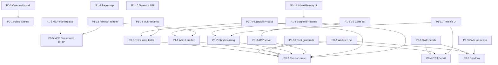

# Pyrfor: План всесторонней доработки → лучшее OSS multi-agent решение для кодинга

**Дата:** 2026-05-14
**Версия плана:** v1.0
**Источник:** синтез 4-агентной исследовательской системы (inventory + multi-agent frameworks + coding agents + infra/protocols) + near-term checklist `pyrfor_complete_before_migration_*.md`
**Связанный документ:** [`PYRFOR-MULTIAGENT-RESEARCH-2026-05-14.md`](./PYRFOR-MULTIAGENT-RESEARCH-2026-05-14.md)

---

## 0. Цель документа

**Главная цель Pyrfor:** стать лучшим open-source решением для мультиагентных систем разработки кода — полноценным со всех сторон (DX, архитектура, безопасность, экосистема, distribution, observability, документация, community).

**НЕ цель:** захват рынка или конкуренция с проприетарными платформами на их условиях.

**Уникальное позиционирование:** **«The Governance Layer for AI Coding»** — единственный OSS-runtime, объединяющий governed lifecycle (plan→research→execute→critique→postmortem→memory_persist), incident packets, trajectory replay, dual-role MCP gateway, cost-aware DAG и нативный Tauri desktop. Целевая аудитория — tech leads, engineering managers, security-aware teams.

Этот документ — **полный план доработки**. Он дополняет (не заменяет) `UNIFIED_PLAN_FINAL.md`, `UNIFIED_PLAN_2026_Q2_UPDATED.md`, `PYRFOR-COMPLETE-ARCHITECTURE-PLAN.md` и `PYRFOR-FINAL-READINESS-AUDIT-2026-05-14.md`. Связи с существующими планами — в Приложении A.

---

## 1. Принципы доработки (инварианты)

| Принцип | Что значит |
|---|---|
| **Local-first** | Всё работает offline. Cloud — опциональный adapter. |
| **Governed by default** | Approvals, audit trail, postmortem не отключаемы для опасных операций. |
| **Open standards** | MCP (Streamable HTTP), A2A, ACP, AG-UI, OpenTelemetry GenAI. Никакого vendor lock-in на протокольном уровне. |
| **TypeScript-first DX** | Generics везде: `SubAgent<TInput,TOutput,TDeps>`, `Orchestrator<TPlan>`. Compile-time safety. |
| **Безопасность через изоляцию** | Sandbox (microsandbox/worktree/sandbox-exec), не «доверяем агенту». |
| **Self-improving loop** | postmortem → eval → optimize замкнут. Каждый run улучшает следующий. |
| **Additive changes** | Существующие 4181+ green tests не должны ломаться. |
| **Платформенная унификация** | `isTauriRuntime()` — единая точка ветвления. Browser-mode деградирует gracefully, не теряет функциональность. |

---

## 2. Roadmap по приоритетам

> Сложность: **S** (≤1 неделя), **M** (1–4 недели), **L** (1–3 месяца), **XL** (>3 месяцев). Без жёстких dates — приоритеты только.

### 2.1 P0 — Критично (без этого продукт не существует)

#### **P0-1. Публичный GitHub + docs.pyrfor.dev + community**
- **Зачем:** «Pyrfor сейчас приватный. Для №1 в open-source нужно: публичный GitHub repo, docs.pyrfor.dev с архитектурой + quickstart, CONTRIBUTING.md с dev environment setup за 10 минут, Discord/Telegram community. Без этого — не open-source, а shared-source.» (research-coding-agents)
- **Что сделать:**
  - Опубликовать `github.com/alexgrebeshok-coder/pyrfor` (или org-аккаунт)
  - Поднять `docs.pyrfor.dev` (Next.js + Mintlify/Docusaurus): quickstart, architecture, API reference, governance model
  - `CONTRIBUTING.md`: dev setup за ≤10 мин, conventional commits, PR template
  - `CODE_OF_CONDUCT.md`, `SECURITY.md`, issue/PR templates
  - Discord или Telegram community канал
- **AC:** репо публичный; `docs.pyrfor.dev` живой; первый внешний contributor может склонировать и запустить за 10 мин по `CONTRIBUTING.md`.
- **Зависимости:** —
- **Сложность:** M
- **Метрика:** 500+ stars в первую неделю; 3+ внешних PR за месяц.

#### **P0-2. One-command install + signed releases**
- **Зачем:** «Aider с `pip install aider-chat` имеет 6.8M установок. Pyrfor с Tauri + pnpm setup имеет тройной барьер.» (research-coding-agents)
- **Что сделать:**
  - Опубликовать `@pyrfor/engine` на npm как standalone CLI: `npx @pyrfor/engine concept "fix bug"` работает за <60 сек
  - Бинарные релизы macOS (arm64/x64), Linux (x64/arm64), Windows (x64) через GitHub Releases
  - Tauri Ed25519-signed auto-updater (`tauri-plugin-updater`, обязательная подпись)
  - macOS notarization в CI (App Sandbox profile отдельно для tool sandbox, см. P0-3)
  - Windows code signing (EV cert)
  - `~/.pyrfor/runtime.json` с дефолтами из env vars; добавить `--model claude-sonnet` флаг
- **AC:** `npx @pyrfor/engine concept "hello"` на чистой машине работает; auto-update проверяется и применяется со signature verification.
- **Зависимости:** P0-1
- **Сложность:** M
- **Метрика:** time-to-first-concept <3 мин; downloads >1k/месяц.

#### **P0-3. Реальный sandbox для tool execution**
- **Зачем:** «Каждый MCP tool вызов должен выполняться в изолированной среде. MCP spec прямо говорит: "Tools represent arbitrary code execution and must be treated with appropriate caution".» (research-infra) Сейчас в Pyrfor — path-guard + process tool, не настоящая песочница.
- **Что сделать (поэтапно):**
  - **L1 минимум:** git worktree per subagent + macOS `sandbox-exec` profile / Linux bubblewrap+seccomp
  - **L2 целевой:** интеграция [microsandbox](https://github.com/microsandbox/microsandbox) — rootless microVMs локально (через Tauri sidecar)
  - **L3 опционально:** E2B adapter для cloud-burst режима
  - Реализовать `SandboxProvider` interface в `packages/engine/src/runtime/sandbox/` с adapters
  - Переключатель в settings: `none | worktree | microvm | cloud`
- **AC:** агент, выполнивший `rm -rf /` в tool call, не повредил host; вынесен в trajectory как blocked event.
- **Зависимости:** —
- **Сложность:** L
- **Метрика:** 100% tool calls на write-операции проходят через sandbox; 0 incidents на host filesystem.

#### **P0-4. OpenTelemetry GenAI semantic conventions**
- **Зачем:** «Без observability невозможен debugging сложных мультиагентных workflow.» (research-infra) Все enterprise клиенты требуют OTel.
- **Что сделать:**
  - Встроить OTLP экспортёр (gRPC + HTTP)
  - Span instrumentation на каждый LLM call / tool call / agent step / lifecycle phase: `gen_ai.system`, `gen_ai.agent.name`, `gen_ai.agent.step`, `gen_ai.usage.input_tokens`, `gen_ai.usage.output_tokens`, `gen_ai.usage.cost`, `gen_ai.request.model`, `gen_ai.response.model`
  - Локальный trace viewer в IDE (новая панель `TraceTimeline`)
  - Из коробки экспорт в self-hosted Langfuse / Phoenix / Laminar (docker-compose в `examples/observability/`)
  - Связать с cost-aware DAG: каждый span содержит cost
- **AC:** запуск `concept` создаёт trace tree; виден в IDE и в Langfuse контейнере; cost рассчитан per-span.
- **Зависимости:** —
- **Сложность:** M
- **Метрика:** 100% LLM/tool calls трассируются; cost совпадает с провайдер-биллингом ±2%.

#### **P0-5. MCP Streamable HTTP + Tauri sidecar lifecycle**
- **Зачем:** «MCP Streamable HTTP (2025-03-26 spec) — текущий стандарт. Pyrfor должен запускать stdio серверы как Tauri sidecars, поддерживать Streamable HTTP, управлять lifecycle.» (research-infra)
- **Что сделать:**
  - Добавить Streamable HTTP transport в `mcp-client.ts` (есть stdio + SSE)
  - Lifecycle менеджер для MCP servers: spawn как Tauri sidecar (`app.shell().sidecar()`), health probe, auto-restart, graceful shutdown
  - Capability negotiation, version pinning
  - UI для управления MCP-серверами в IDE (новая панель `McpServersPanel`)
- **AC:** можно подключить `streamable-http` MCP сервер; sidecar-MCP стартует с приложением и переживает падения.
- **Зависимости:** —
- **Сложность:** M
- **Метрика:** ≥5 MCP-серверов одновременно без утечек памяти за 24h.

#### **P0-6. SWE-bench Lite/Verified прогон + публичный badge**
- **Зачем:** «Без публичного benchmark нет доверия разработчиков. Это главный инструмент привлечения аудитории.» (research-coding-agents)
- **Что сделать:**
  - Harness для SWE-bench Lite (300 задач) через Universal Engine с Claude Sonnet / GPT-5
  - GitHub Actions workflow: nightly run, artifacts с trajectories
  - Badge в README; страница `docs.pyrfor.dev/benchmarks` с историей
  - Сравнение: ваниль chat-loop vs governed lifecycle (постмортем-фаза должна показывать преимущество)
  - Опционально: Terminal-bench, OSWorld (через `pyrfor browser` + sandbox)
- **AC:** воспроизводимый score опубликован; разница «with postmortem / without» измерена.
- **Зависимости:** P0-3 (sandbox для безопасного исполнения), P0-4 (для cost/perf метрик)
- **Сложность:** L
- **Метрика:** SWE-bench Lite ≥40% (минимум для credibility), целевой ≥55%.

#### **P0-7. Единый run substrate (canonical lifecycle API)**
- **Зачем:** «Нет явного единого run lifecycle substrate во всех слоях, хотя `run-lifecycle.ts` уже есть; интеграция поверх него неполная.» (pyrfor-inventory)
- **Что сделать:**
  - `run-lifecycle.ts` → каноническое state machine API; все API/UI/CLI читают через него
  - Унифицировать события: `plan_started`, `research_started`, `execute_started`, `critique_started`, `postmortem_started`, `memory_persisted`, `done`, `aborted`, `failed`, `suspended`, `resumed`
  - Event bus (см. §3) подписан на эти события; AG-UI emitter (P1-1) и OTel (P0-4) — consumers
  - Мигрировать `subagents`, `subagent-orchestrator`, `engine-loop`, `acp-bridge` на единый lifecycle
- **AC:** `pyrfor concept trace <id>` показывает единый lifecycle; UI и CLI отображают одно и то же state machine.
- **Зависимости:** —
- **Сложность:** M
- **Метрика:** 0 lifecycle event mismatches между UI/CLI/API за 1 неделю прогона.

#### **P0-8. Worktree isolation для subagents**
- **Зачем:** «Subagent worktree isolation заявлена в inventory, но в просмотренных файлах явного worktree-менеджера не увидел.» (pyrfor-inventory)
- **Что сделать:**
  - `WorktreeManager` в `packages/engine/src/runtime/worktree/`: create/destroy/list/cleanup
  - Каждый subagent получает свой `git worktree add` с уникальным branch
  - Auto-merge / cherry-pick результата в parent после approval
  - Conflict resolution UI в IDE
  - Cleanup hook на crash/abort
- **AC:** 5 параллельных subagents работают в изолированных worktrees; результаты безопасно сливаются в parent после approval.
- **Зависимости:** P0-3 (worktree — слой L1 sandbox), P0-7
- **Сложность:** M
- **Метрика:** 0 cross-contamination между subagent worktrees.

#### **P0-9. Permission ladder — formalize и привязать к tool execution**
- **Зачем:** «Нет отдельного permission ladder engine как полноценного продукта — пока больше approval flow.» (pyrfor-inventory) MCP spec требует explicit user consent.
- **Что сделать:**
  - Capability-based permission model: `read_fs`, `write_fs`, `network`, `exec`, `git_write`, `secret_read`, `subagent_spawn`, `cost_spend`
  - Permission ladder: `denied < ask < auto_with_audit < auto_silent`
  - Каждый tool декларирует требуемые capabilities; ApprovalFlow проверяет перед execution
  - UI: Trust Panel показывает grants + history; revoke button
  - Persisted в SQLite, scoped per project / per session / per agent
- **AC:** запуск любого tool без granted capability → blocked + audit event; UI показывает понятный prompt.
- **Зависимости:** P0-7
- **Сложность:** M
- **Метрика:** 100% tool executions проходят через capability check.

#### **P0-10. Cost/budget guardrails (end-to-end)**
- **Зачем:** «Cost-aware DAG есть, но не видно end-to-end budget enforcement на уровне всех runs.» (pyrfor-inventory)
- **Что сделать:**
  - `BudgetPolicy` per run / per subagent / per session / per day / per project
  - Hard / soft limits; soft → warning event, hard → abort с graceful save
  - Pre-execution estimate (token forecasting через tokenizer); reject если estimate > remaining budget
  - Cost dashboard в IDE (новая панель `CostInsights`)
  - Связь с OTel (P0-4) и postmortem (cost вынесен в incident packet)
- **AC:** запуск с budget=$1 не превышает $1.05 (с учётом partial step); hard-limit abort пишет ledger entry.
- **Зависимости:** P0-4, P0-7
- **Сложность:** M
- **Метрика:** 0 budget overruns >5% за месяц прогона.

---

### 2.2 P1 — Конкурентные преимущества

#### **P1-1. AG-UI Protocol emitter (first-class)**
- **Зачем:** «AG-UI становится стандартом для frontend↔agent коммуникации (LangGraph, CrewAI, Google ADK, AWS, Agno, VoltAgent). Если Pyrfor поддерживает AG-UI — мгновенный доступ к экосистеме CopilotKit.» (research-multiagent-frameworks)
- **Что сделать:**
  - Реализовать events: `RunStarted`, `RunFinished`, `RunError`, `TextMessageStart/Content/End`, `ToolCallStart/Args/End` (streaming), `StateSnapshot`, `StateDelta` (JSON Patch), `RunFinished{outcome:"interrupt"}` для HITL
  - Endpoint в gateway: `POST /agent/run` + SSE stream с AG-UI events
  - Совместимость со spec docs.ag-ui.com
  - Adapter: lifecycle events (P0-7) → AG-UI events
- **AC:** CopilotKit React app может подключиться к Pyrfor и стримить лайв.
- **Зависимости:** P0-7
- **Сложность:** M
- **Метрика:** demo с CopilotKit работает; conformance test passes.

#### **P1-2. CheckpointStore<State> — durable resume / time-travel / fork**
- **Зачем:** «LangGraph хранит Checkpoint на каждом шаге → resume after failure, time-travel, fork, human interrupt+resume. Это ключевой enterprise selling point.» (research-multiagent-frameworks)
- **Что сделать:**
  - `CheckpointStore<State>` interface в `packages/engine/src/runtime/checkpoint/`
  - Adapters: `InMemoryCheckpointStore`, `SqliteCheckpointStore`, `PostgresCheckpointStore`
  - Каждый lifecycle phase создаёт checkpoint с uuid6
  - CLI: `concept resume <runId>`, `concept fork <checkpointId>`, `concept timetravel <checkpointId>`
  - UI: Trajectory Timeline с возможностью fork/resume на любом checkpoint
  - Интеграция с trajectory recorder (поверх существующего)
- **AC:** убить процесс посреди run → `concept resume` восстанавливает state и продолжает; fork даёт независимую ветку.
- **Зависимости:** P0-7
- **Сложность:** L
- **Метрика:** resume rate >95% после crash; fork работает на любом checkpoint.

#### **P1-3. ACP server → Pyrfor в Zed / JetBrains**
- **Зачем:** «90%+ разработчиков живут в VS Code или JetBrains. Desktop-only Tauri app = высокий порог входа. ACP протокол позволяет Pyrfor стать кодинг-агентом в Zed без написания плагина с нуля.» (research-coding-agents)
- **Что сделать:**
  - `packages/engine/src/acp/server.ts`: ACP stdio/HTTP сервер по spec agentclientprotocol.com
  - Запуск: `npx @pyrfor/engine acp`
  - Phase 1 (init + prompt handling) обязательно; Phase 2 (tool calls) — желательно
  - Регистрация в [agentclientprotocol/registry](https://github.com/agentclientprotocol/registry)
  - Тестовый Zed config в `examples/zed-config.json`
- **AC:** Zed подключает Pyrfor как агент; prompt → response работает; trajectory record через ACP bridge.
- **Зависимости:** P0-7
- **Сложность:** M
- **Метрика:** Pyrfor в registry; 100+ Zed-пользователей за месяц после запуска.

#### **P1-4. Tree-sitter repo-map в UniversalPlanner**
- **Зачем:** «Без semantic repo map агент "слеп" в больших кодовых базах — не понимает структуру, делает лишние вызовы. Aider — best-in-class.» (research-coding-agents)
- **Что сделать:**
  - `RepoMapProvider` в `packages/engine/src/runtime/repo-map/`
  - Tree-sitter WASM (или нативные биндинги) для 30+ языков (TS/JS/Py/Rust/Go/Java/C++/...)
  - Граф символов: definitions, references, imports
  - Передавать summary как `PlanContext.repoSummary` в planner phase
  - Кэш в SQLite (invalidate by mtime)
  - CLI: `pyrfor repomap show`
- **AC:** для проекта 10k+ LOC план на первой попытке указывает правильные файлы (≥80% precision).
- **Зависимости:** —
- **Сложность:** L
- **Метрика:** план-precision ↑ ≥30% vs baseline без repo-map.

#### **P1-5. VS Code extension (поверх ACP/MCP)**
- **Зачем:** Закрыть 90%-аудиторию IDE-пользователей.
- **Что сделать:**
  - `vscode-extension/` (уже есть скелет в репо)
  - Доделать: подключение к Pyrfor engine через ACP (P1-3) или прямой WebSocket gateway
  - Sidebar panels: Chat, Trust, Trajectory, Cost
  - Inline code actions (как Cline/Continue)
  - Опубликовать в VS Code Marketplace + Open VSX
- **AC:** установка из marketplace → работает без дополнительной настройки.
- **Зависимости:** P1-3
- **Сложность:** L
- **Метрика:** 1k+ installs за квартал; ★ ≥4.0.

#### **P1-6. MCP Marketplace**
- **Зачем:** «Virality через плагины — разработчики делятся своими MCP серверами и плагинами, каждый новый плагин = новые пользователи.» (research-coding-agents)
- **Что сделать:**
  - `pyrfor.dev/extensions` — статический сайт (Next.js) с curated списком
  - Первые 20 серверов: GitHub, Linear, Postgres, Slack, Notion, Sentry, Datadog, Filesystem, Browser, Docker, Stripe, GitLab, Jira, Confluence, AWS, GCP, Kubernetes, Redis, Elasticsearch, Prometheus
  - CLI: `pyrfor mcp add github` / `pyrfor mcp list` / `pyrfor mcp remove`
  - One-click install в IDE: panel `Marketplace` с install кнопкой
  - Submission flow для community (PR в `pyrfor-mcp-registry` repo)
- **AC:** можно установить любой из 20 серверов одной командой; submission PR от внешнего автора принят.
- **Зависимости:** P0-5
- **Сложность:** M
- **Метрика:** 10+ community-сделанных серверов за полугодие.

#### **P1-7. Plugin / Skill / Hooks система**
- **Зачем:** «Skills, hooks (pre/post tool), slash-commands — паттерны 2026 года (Claude Code, Cognee, Cursor).» (research-infra)
- **Что сделать:**
  - **Hooks lifecycle:** `SessionStart`, `UserPromptSubmit`, `PreToolUse`, `PostToolUse`, `PreCompact`, `SessionEnd` — YAML config в `~/.pyrfor/hooks/`
  - **Skills:** YAML/MD контекстные файлы в `~/.pyrfor/skills/`; auto-load в context при матчинге паттерна; SKILL.md spec совместимый с agentskills.io
  - **Slash-commands:** `/explain`, `/refactor`, `/test`, кастомные через TOML в `~/.pyrfor/commands/`
  - CLI: `pyrfor skills list/add/remove`, `pyrfor hooks list/test`
  - Marketplace для skills (как extensions, см. P1-6)
- **AC:** hook `PreToolUse` может блокировать tool call; slash-command `/test` запускает predefined workflow.
- **Зависимости:** P0-7, P0-9
- **Сложность:** L
- **Метрика:** 5+ официальных skills; 10+ community skills за полугодие.

#### **P1-8. Suspend/Resume API в executor**
- **Зачем:** «Mastra/VoltAgent: чистейший API для HITL — `ctx.suspend(reason, meta)` + `runner.resume(execId, decision)`. Approval flow Pyrfor уже есть, но стоит унифицировать.» (research-multiagent-frameworks)
- **Что сделать:**
  - `SubagentContext.suspend(reason, metadata)` → создаёт checkpoint (P1-2) + emit `RunFinished{outcome:"interrupt"}` (P1-1)
  - `Runner.resume(executionId, decision)` → загружает checkpoint, продолжает с decision injected
  - Унифицировать с существующим approval flow: approval = частный случай suspend
  - UI: Approval Inbox панель показывает все suspended runs
- **AC:** агент может pause посреди execute, ждать пользовательского input, продолжить.
- **Зависимости:** P0-7, P1-1, P1-2
- **Сложность:** M
- **Метрика:** suspend→resume cycle <500ms latency.

#### **P1-9. Code-as-action субагент через sandbox**
- **Зачем:** «smolagents доказал: Code-as-action лучше tool-calling на 30%.» (research-multiagent-frameworks)
- **Что сделать:**
  - `CodeExecutorSubagent`: генерирует TS/Python код вместо JSON tool call
  - Исполняет в sandbox (P0-3) — microsandbox / E2B / Docker
  - Возвращает stdout/stderr/result в orchestrator
  - Особенно мощно в research-фазе lifecycle
  - Templates: `pyrfor concept --action-mode=code "fetch and analyze X"`
- **AC:** research-фаза с code-as-action использует ≥30% меньше шагов на тестовых сценариях.
- **Зависимости:** P0-3
- **Сложность:** M
- **Метрика:** −30% steps; +20% success rate в research-задачах.

#### **P1-10. TypeScript generics-first API**
- **Зачем:** «Pyrfor — единственный TypeScript-native orchestrator с lifecycle. Это нужно сделать главным DX аргументом. Pydantic-AI победил в Python именно через DX + types.» (research-multiagent-frameworks)
- **Что сделать:**
  ```typescript
  class SubAgent<TInput, TOutput, TDeps extends Record<string, unknown>> {
      constructor(config: AgentConfig<TInput, TOutput, TDeps>) {}
      async run(input: TInput, deps: TDeps): Promise<AgentResult<TOutput>> {}
  }
  class Orchestrator<TPlan extends BasePlan, TResult> {
      execute(plan: TPlan): Promise<OrchestratorResult<TResult>>
  }
  ```
  - Refactor `subagents.ts`, `subagent-orchestrator.ts`, lifecycle на generics
  - Zod schemas для input/output validation на runtime
  - IDE autocomplete + compile-time errors
  - Migration guide для существующих consumers
- **AC:** internal test suite использует generics; type errors ловятся compile-time (не runtime).
- **Зависимости:** —
- **Сложность:** L
- **Метрика:** 0 runtime type errors в test suite после миграции.

#### **P1-11. Agent Timeline + Replay UI (first-class в IDE)**
- **Зачем:** «В IDE нет явного agent timeline/replay UI в текущих компонентах.» (pyrfor-inventory) Critical для debugging multi-agent flows.
- **Что сделать:**
  - Новый компонент `apps/pyrfor-ide/web/src/components/AgentTimeline.tsx`
  - Visual timeline: phases (plan/research/execute/critique/postmortem) × subagents × time
  - Click на event → детали (LLM call, tool call, approval, cost)
  - Replay button: re-run от любого checkpoint (P1-2)
  - Diff viewer: между runs / forks
  - Export incident packet button
- **AC:** разработчик debugger'ит multi-agent run за <2 мин (vs grep по логам).
- **Зависимости:** P1-2, P0-4
- **Сложность:** L
- **Метрика:** time-to-debug ↓ ≥50%.

#### **P1-12. Approval Inbox + Memory Browser (зрелые экраны IDE)**
- **Зачем:** «Desktop UI не видно agent timeline, approval inbox, memory browser как отдельных зрелых экранов.» (pyrfor-inventory)
- **Что сделать:**
  - `ApprovalInbox.tsx`: список suspended runs (P1-8), bulk approve/deny, filter по agent/tool/cost
  - `MemoryBrowser.tsx`: FTS5 search по memory store, browse wiki links, edit memory blocks (P2-2)
  - Интеграция с notification system (OS-native через Tauri)
- **AC:** все pending approvals видны в одном месте; memory можно искать без CLI.
- **Зависимости:** P1-8
- **Сложность:** M

#### **P1-13. Единый Protocol Adapter Layer (MCP / A2A / ACP / AG-UI)**
- **Зачем:** «MCP/A2A есть, но full product-level routing/auth/degraded-mode UX ещё не доматчены. Свести MCP/A2A/ACP в единый adapter/router слой.» (pyrfor-inventory)
- **Что сделать:**
  - `packages/engine/src/runtime/protocols/`: единый `ProtocolAdapter` interface
  - Adapters: `McpAdapter`, `A2aAdapter`, `AcpAdapter`, `AgUiAdapter`
  - Router: маршрутизация tool calls / agent calls / events через адекватный protocol
  - Auth layer: tokens, OAuth, mTLS — единый
  - Degraded mode: при падении одного протокола fallback на другой (если возможно)
- **AC:** добавление нового протокола = новый adapter, без изменений в lifecycle.
- **Зависимости:** P0-5, P1-1
- **Сложность:** L

#### **P1-14. Multi-tenancy + RBAC**
- **Зачем:** «Agno имеет JWT-based RBAC и multi-tenant isolation. Для enterprise это must-have.» (research-multiagent-frameworks)
- **Что сделать:**
  - `ApprovalContext{userId, tenantId, permissions}` сквозь весь lifecycle
  - JWT issuance / verification (через Tauri sidecar для desktop, gateway для shared mode)
  - Tenant-scoped memory / projects / approvals
  - Role templates: `admin`, `developer`, `viewer`, `auditor`
- **AC:** в shared-mode 2 пользователя видят только свои runs/memory.
- **Зависимости:** P0-9
- **Сложность:** L

---

### 2.3 P2 — Лидерство в long-tail

#### **P2-1. Eval loop в postmortem-фазе (DSPy-style)**
- **Зачем:** «Postmortem у Pyrfor — золото, которое не используется полностью. Замкнуть петлю: run → postmortem → eval → optimize → следующий run лучше.» (research-multiagent-frameworks)
- **Что сделать:**
  - Postmortem auto-generates eval examples из trajectory
  - Scoring metrics: relevance, tool efficiency, cost per outcome, plan accuracy
  - DSPy-style optimizer для subagent prompts (auto few-shot selection)
  - Trainset persisted в `~/.pyrfor/trainsets/`
  - CLI: `pyrfor eval run`, `pyrfor optimize <subagent>`
- **AC:** через 100 runs subagent prompts оптимизированы автоматически; metrics улучшаются.
- **Зависимости:** P0-7, P1-2
- **Сложность:** L
- **Метрика:** +15% success rate после 100 optimization runs.

#### **P2-2. Memory blocks (Letta-pattern) + agent-editable + archival vector**
- **Зачем:** «Letta доказал: agent-editable memory с archival — killer feature для long-running agents.» (research-multiagent-frameworks + research-infra)
- **Что сделать:**
  - Typed memory_blocks: `persona`, `context`, `facts`, `preferences`, `project_state`
  - Tools для агента: `core_memory_append`, `core_memory_replace`, `archival_insert`, `archival_search`
  - Archival vector store: локальные embeddings (`nomic-embed-text` через Tauri sidecar / Ollama)
  - Memory diff в postmortem (что нового агент узнал)
  - Cross-session memory persistence
- **AC:** агент помнит preferences пользователя через 30+ sessions; semantic search работает offline.
- **Зависимости:** —
- **Сложность:** L

#### **P2-3. Continuous eval pipeline (CI templates)**
- **Зачем:** «Top OSS frameworks делают continuous eval. Без — регрессии незаметны.» (research-infra)
- **Что сделать:**
  - GitHub Actions templates: SWE-bench Lite, Terminal-bench, OSWorld, Inspect AI, DeepEval, promptfoo
  - `pyrfor eval suite` CLI
  - Dashboard для tracking регрессий между релизами
  - Red-teaming через promptfoo (prompt injection tests)
- **AC:** PR ломающий SWE-bench score >5% автоматически блокируется CI.
- **Зависимости:** P0-6
- **Сложность:** M

#### **P2-4. Knowledge-graph memory (Graphiti-inspired)**
- **Зачем:** «Temporal knowledge graph — entity linking, relationship tracking, temporal reasoning. Позволяет агентам понимать "как изменился контекст со временем".» (research-infra)
- **Что сделать:**
  - Поверх SQLite: таблицы entities, relationships, temporal edges
  - Auto-extract entities из trajectory (через LLM)
  - Query API: `memory.entities.related("ProjectX", since="2026-01-01")`
  - Visualization в IDE (force-directed graph)
- **AC:** агент отвечает на «что изменилось в ProjectX за последний месяц» с references на конкретные edges.
- **Зависимости:** P2-2
- **Сложность:** L

#### **P2-5. Plan branching / compare (Plandex-pattern)**
- **Зачем:** «Plandex имеет это как killer feature. Trajectory + postmortem делают comparison осмысленным.» (research-coding-agents)
- **Что сделать:**
  - CLI: `concept branch create <name>`, `concept branch compare <a> <b>`
  - Запустить один concept с разными models / providers / prompts → diff результатов + cost
  - UI: side-by-side diff viewer
- **AC:** `concept branch compare claude-sonnet gpt-5` показывает diff кода + cost + quality metrics.
- **Зависимости:** P1-2
- **Сложность:** M

#### **P2-6. Browser tool first-class (Playwright/CDP)**
- **Зачем:** «Сейчас browser — только через MCP. Browser + governed lifecycle = "browse-plan-code-verify" loop.» (research-coding-agents)
- **Что сделать:**
  - `packages/engine/src/runtime/tools/browser.ts`: Playwright (через Tauri sidecar)
  - allowedHosts whitelist; approval для каждого нового origin
  - Screenshot capture, DOM inspection, action recording
  - Интеграция с existing `browser-control.ts` / `browser-readiness.ts`
  - Governed: каждое действие в trajectory + approval ladder
- **AC:** `pyrfor concept "read docs at URL and implement API"` работает end-to-end.
- **Зависимости:** P0-3, P0-9
- **Сложность:** L

#### **P2-7. @pyrfor/mcp-docs — docs-as-MCP**
- **Зачем:** «Документация как MCP — это 2026-стандарт DX. VoltAgent имеет mcp-docs-server.» (research-multiagent-frameworks)
- **Что сделать:**
  - MCP сервер с документацией Pyrfor
  - Подключается к Cursor/Claude/Pyrfor → AI знает API
  - Опубликовать в npm: `npx @pyrfor/mcp-docs`
- **AC:** `claude` подключённый к `@pyrfor/mcp-docs` корректно отвечает на «как создать subagent в Pyrfor».
- **Зависимости:** P0-1
- **Сложность:** S

#### **P2-8. Tauri Stronghold + cargo-sbom + cosign**
- **Зачем:** «Полный security pipeline критичен для доверия enterprise.» (research-infra)
- **Что сделать:**
  - Мигрировать секреты на `tauri-plugin-stronghold` (encrypted vault) + macOS Keychain / Windows Credential Manager
  - SBOM генерация: `cargo-sbom` для Rust deps, `npm sbom` для JS
  - Cosign signed releases + Sigstore transparency log
  - Renovate / Dependabot включены; `cargo audit` + `npm audit` в CI
- **AC:** SBOM публикуется с каждым release; `cosign verify` проходит.
- **Зависимости:** P0-2
- **Сложность:** M

#### **P2-9. Cost analytics dashboard в IDE**
- **Зачем:** Cost-aware DAG + OTel = уникальный продукт для FinOps в AI.
- **Что сделать:**
  - Панель `CostAnalytics.tsx`: cost by provider/model/agent/project/time
  - Forecasting: projected monthly spend
  - Alerts: budget anomalies
- **AC:** разработчик за 30 сек видит топ-5 cost contributors за неделю.
- **Зависимости:** P0-4, P0-10
- **Сложность:** M

#### **P2-10. `npm create pyrfor@latest` scaffolding CLI**
- **Зачем:** «Mastra (`npm create mastra@latest`), VoltAgent — оба имеют zero-friction CLI onboarding.» (research-multiagent-frameworks)
- **Что сделать:**
  - `create-pyrfor` package: интерактивный CLI с templates
  - Templates: `coding-agent`, `research-agent`, `web-scraper`, `data-pipeline`, `custom-skill`
- **AC:** `npm create pyrfor@latest my-agent` за 60 сек создаёт работающий проект.
- **Зависимости:** P0-2
- **Сложность:** S

---

### 2.4 P3 — Маркетинг и community

| ID | Название | Описание | Метрика |
|---|---|---|---|
| P3-1 | Show HN | "Show HN: Pyrfor — local-first governed AI coding workspace with incident packets" | Top 5 on HN; 1k+ stars/неделя |
| P3-2 | Blog post | "Why every AI coding agent needs postmortem phases" — Medium/Substack | 5k+ views |
| P3-3 | YouTube demo | 5 мин: concept → plan → execute → postmortem → memory | 10k+ views |
| P3-4 | Позиционирование | Landing + README: "The Governance Layer for AI Coding" | Featured в "enterprise AI coding tools" lists |
| P3-5 | Community | Discord/Telegram + weekly office hours | 500+ members за полугодие |
| P3-6 | Conference talks | AI Engineer Summit, KubeCon AI day, JSConf | 3+ talks за год |
| P3-7 | Newsletter | "Pyrfor Weekly" — releases, plugins, community | 1k+ subscribers |

---

## 3. Архитектурные изменения (cross-cutting)

### 3.1 Единый Event Bus
- Все слои (lifecycle, AG-UI emitter, OTel exporter, IDE UI, CLI, ACP server, hooks) подписаны на один `RuntimeEventBus`
- Типизированные события (Zod schemas)
- Backpressure-safe (bounded queues)
- Заменяет ad-hoc EventEmitter'ы

### 3.2 Adapter pattern для протоколов
- `ProtocolAdapter` interface (P1-13)
- Без cross-protocol coupling в core lifecycle

### 3.3 Capability-based permission model (см. P0-9)
- Заменяет boolean flags

### 3.4 Plugin loader
- Tauri sidecar для нативных плагинов
- MCP server для tool plugins
- Hooks system для lifecycle plugins

### 3.5 Storage abstraction
- `CheckpointStore` (P1-2)
- `MemoryStore` (существует, нужна унификация adapters)
- `ArtifactStore` (для incident packets, exports)
- `TrajectoryStore` (существует)
- Все с pluggable backends (sqlite/postgres/s3)

---

## 4. Граф зависимостей (P0/P1)



---

## 5. Что НЕ делаем (явно вне скоупа)

- **Cloud-hosted multi-tenant SaaS** — Pyrfor остаётся local-first; SaaS-обвязка возможна только как сторонний adapter, не часть core
- **Vendor lock-in** на одного LLM-провайдера — multi-provider router всегда первый класс
- **Закрытие исходников** — все ядра остаются open-source (MIT/Apache-2.0)
- **Replace VS Code/JetBrains** — Pyrfor дополняет через ACP/extension, не пытается стать заменой
- **Mobile** — не приоритет; через web/PWA при желании, но не первый класс
- **Полная замена git/CI** — Pyrfor интегрируется, не дублирует

---

## 6. Метрики успеха продукта

| Метрика | Цель (полугодие+) |
|---|---|
| GitHub stars | 1000+ |
| Time-to-first-concept | <3 минуты с нуля |
| MCP-серверов в marketplace | 20+ (5+ community) |
| SWE-bench Lite badge | ≥40% |
| ACP availability в Zed registry | ✅ |
| Enterprise pilots с governance use-case | 1+ |
| Blog mentions в AI/dev-tooling community | 5+ |
| External contributors | 10+ |
| MTBF (mean time between failures) | >7 дней |
| 4181+ tests | сохранены green; +2000 новых |

---

## 7. Риски и митигация

| # | Риск | Вероятн. | Impact | Митигация |
|---|---|---|---|---|
| R1 | Sandbox security exploit | Medium | Critical | microsandbox + defense-in-depth (capability + worktree); bug bounty |
| R2 | Prompt injection в tool descriptions | High | High | MCP spec compliance; content filtering; trusted-server flag |
| R3 | Протокольный фрагмент (MCP/A2A/ACP/AG-UI расходятся) | Medium | High | Adapter layer (P1-13); версионный pinning; conformance tests |
| R4 | Performance Tauri WebView на больших проектах | Medium | Medium | Profiling в CI; виртуализация списков; offload в Rust |
| R5 | Contributor onboarding слишком сложный | High | High | CONTRIBUTING.md ≤10 мин; office hours; mentor program |
| R6 | SWE-bench underperformance vs OpenHands | High | Medium | Позиционирование на governance, не на raw score; показывать lifecycle benefit |
| R7 | OpenHands enterprise tier забирает enterprise customers | Medium | Medium | Free local-first + transparent governance; community-driven |
| R8 | Vendor API breaking changes (OpenAI/Anthropic) | High | Low | Multi-provider router; adapter pattern; circuit breaker |
| R9 | macOS notarization задерживает релизы | Medium | Low | Автоматизация в CI; app-specific password rotation |
| R10 | Memory FTS5 не масштабируется на 100k+ entries | Low | Medium | Bench до 1M entries; fallback на vector store + KG |
| R11 | Tauri 2 breaking changes | Low | High | Pin major version; migration guide для plugin authors |
| R12 | Community fragmentation (форки) | Low | Medium | Clear governance model; CLA опционально; transparent decisions |

---

## 8. Сводная таблица всех задач

| ID | Pri | Название | Сложн. | Зависимости | AC (1 строка) |
|---|---|---|---|---|---|
| P0-1 | P0 | Public GitHub + docs + community | M | — | Внешний contributor запускает за 10 мин |
| P0-2 | P0 | One-command install + signed releases | M | P0-1 | `npx @pyrfor/engine` работает |
| P0-3 | P0 | Sandbox для tool execution | L | — | `rm -rf /` blocked |
| P0-4 | P0 | OTel GenAI semantic conventions | M | — | Trace tree в Langfuse |
| P0-5 | P0 | MCP Streamable HTTP + sidecar lifecycle | M | — | 5 MCP серверов 24h без утечек |
| P0-6 | P0 | SWE-bench Lite + badge | L | P0-3, P0-4 | Score опубликован, ≥40% |
| P0-7 | P0 | Единый run substrate | M | — | 0 lifecycle mismatches UI/CLI |
| P0-8 | P0 | Worktree isolation | M | P0-3, P0-7 | 5 параллельных subagents изолированы |
| P0-9 | P0 | Permission ladder | M | P0-7 | 100% tool calls через capability check |
| P0-10 | P0 | Cost guardrails end-to-end | M | P0-4, P0-7 | Budget=$1 не превышен >$1.05 |
| P1-1 | P1 | AG-UI emitter | M | P0-7 | CopilotKit подключён |
| P1-2 | P1 | CheckpointStore + resume/fork | L | P0-7 | Resume rate >95% |
| P1-3 | P1 | ACP server | M | P0-7 | В Zed registry |
| P1-4 | P1 | Tree-sitter repo-map | L | — | Plan precision +30% |
| P1-5 | P1 | VS Code extension | L | P1-3 | 1k+ installs |
| P1-6 | P1 | MCP marketplace | M | P0-5 | 20 серверов; community PR |
| P1-7 | P1 | Plugin/Skill/Hooks | L | P0-7, P0-9 | 5 official + 10 community skills |
| P1-8 | P1 | Suspend/Resume API | M | P0-7, P1-1, P1-2 | suspend→resume <500ms |
| P1-9 | P1 | Code-as-action | M | P0-3 | −30% steps в research |
| P1-10 | P1 | TS generics API | L | — | 0 runtime type errors |
| P1-11 | P1 | Agent Timeline UI | L | P1-2, P0-4 | Time-to-debug −50% |
| P1-12 | P1 | Approval Inbox + Memory Browser | M | P1-8 | UI экраны зрелые |
| P1-13 | P1 | Protocol Adapter Layer | L | P0-5, P1-1 | Новый протокол = adapter |
| P1-14 | P1 | Multi-tenancy + RBAC | L | P0-9 | 2 tenants изолированы |
| P2-1 | P2 | Eval loop в postmortem | L | P0-7, P1-2 | +15% success после 100 runs |
| P2-2 | P2 | Memory blocks + archival vector | L | — | Cross-session preferences |
| P2-3 | P2 | Continuous eval CI | M | P0-6 | Регрессии блокируют PR |
| P2-4 | P2 | Knowledge-graph memory | L | P2-2 | Temporal queries работают |
| P2-5 | P2 | Plan branching/compare | M | P1-2 | branch compare показывает diff |
| P2-6 | P2 | Browser tool first-class | L | P0-3, P0-9 | URL→implement end-to-end |
| P2-7 | P2 | @pyrfor/mcp-docs | S | P0-1 | Claude знает Pyrfor API |
| P2-8 | P2 | Stronghold + SBOM + cosign | M | P0-2 | `cosign verify` проходит |
| P2-9 | P2 | Cost analytics dashboard | M | P0-4, P0-10 | Top-5 cost за 30 сек |
| P2-10 | P2 | `create-pyrfor` CLI | S | P0-2 | Scaffold за 60 сек |
| P3-1..7 | P3 | Marketing & community | S-M | P0-1 | См. таблицу §2.4 |

---

## 9. IDE Polish & Migration Readiness (near-term checklist)

> Источник: `pyrfor_complete_before_migration_65da1ec4_e375_43d0_a2f1_c4cd3.md` (14.05.2026). Это **тактический слой** — конкретные фиксы перед OpenClaw migration. Дополняет, не заменяет стратегические задачи P0-P2 выше.

### 9.1 IDE Bug Fixes (CRITICAL — pre-migration blockers)

| ID | Файл | Проблема | Фикс | Связь со стратегией |
|---|---|---|---|---|
| N0-1 | `apps/pyrfor-ide/web/src/App.tsx` L406-422 | Hamburger `☰` onClick только mobile, desktop ничего не делает | Добавить `menuOpen` state, dropdown: Open Folder / Settings / Help / About; close on click outside | дополняет P1-12 (зрелые UI экраны) |
| N0-2 | `ChatPanel.tsx` L751 | Clipboard paste не работает в Tauri | Explicit `onPaste` handler с `e.clipboardData.getData('text')`; Tauri clipboard permission в `tauri.conf.json` | базовый UX |
| N0-3 | `Terminal.tsx` L37, `src-tauri/src/main.rs` | Terminal требует daemon (port 3210), не auto-start | Spawn daemon как Tauri sidecar; health check + "Daemon offline" badge в App.tsx | связано с P0-5 (sidecar lifecycle) |
| N0-4 | вся IDE | Browser vs Desktop расхождение | Использовать существующий `isTauriRuntime()` из `SettingsModal.tsx`; все компоненты ветвят поведение, browser-mode имеет graceful fallbacks; README: how to run browser vs desktop | принцип «платформенная унификация» из §1 |

**AC всех N0-*:** все 4 фикса проходят `npm run build` в IDE + `pnpm test` в engine; 4181 green tests сохранены.

### 9.2 Visual Polish (7 задач)

| ID | Задача | Файлы | Описание |
|---|---|---|---|
| N1-1 | Color Token System | `App.tsx`, CSS | CSS variables / Tailwind tokens: `--bg-primary:#1e1f26`, `--bg-secondary:#252831`, `--bg-tertiary:#2c2e3a`, `--text-primary:#e4e4e7`, `--text-secondary:#a1a1aa`, `--accent:#3b82f6`, `--border:#3f3f46`. Заменить все hardcoded colors. **Foundation для остального visual work.** |
| N1-2 | Topbar Hierarchy | `App.tsx` L406-474 | Group: left (nav+workspace), center (model badge), right (actions). Save button icon-only без white bg, `opacity-70 hover:opacity-100`. Consistent 24px icons. Border-bottom на header |
| N1-3 | Files Sidebar Empty State | `FileTree.tsx` | Folder-open icon + "No folder open" с лучшим контрастом; inline "Open Folder" CTA; title "FILES" с bottom border |
| N1-4 | Welcome Page | `App.tsx` L516-528 | Заменить `<div>P</div>` на Pyrfor logo; card grid: Open Folder / Clone Repo / New File; каждая карточка: icon + label + keyboard shortcut |
| N1-5 | Chat Empty State | `ChatPanel.tsx` | Suggestion chips: "Explain this code", "Find bugs", "Refactor this file"; subtle animation на first open |
| N1-6 | Bottom Panel Tabs | `BottomPanel.tsx` | Uniform background; active tab — blue bottom border 2px; hide floating DevTools icons в production |
| N1-7 | Tauri Chrome | `src-tauri/tauri.conf.json` | `"titleBarStyle": "Overlay"` для macOS native feel; `"hiddenTitle": true` если custom titlebar |

**Связь со стратегией:** базовый UX-фундамент перед P1-11 (Agent Timeline) и P1-12 (Approval Inbox / Memory Browser).

### 9.3 Migration Readiness (перед OpenClaw → Pyrfor миграцией)

| ID | Задача | AC |
|---|---|---|
| N2-1 | Test Memory Migration | `pyrfor migrate openclaw --from ~/.openclaw --dry-run` → MEMORY.md, memory/*.md, skills, sessions, config все импортированы; quarantine states видны; 0 data loss |
| N2-2 | Verify Voice Pipeline | Whisper STT (whisper-cli + ggml-small.bin) работает в Pyrfor runtime; TTS (edge-tts, ru-RU-DmitryNeural) producutes voice messages; Telegram voice attachment handling matches OpenClaw |
| N2-3 | Test Skill Import | Импорт skills: decision-council, nightly-meeting, memory-watchdog; quarantined → approval flow работает; skill execution в Pyrfor engine успешен |
| N2-4 | Subagent Spawning Parity | Pyrfor subagent orchestrator ↔ OpenClaw sessions_spawn parity; spawn isolated agent → result через Result Lock — связано с P0-8 |
| N2-5 | Skills Marketplace bootstrap | Создать `github.com/alexgrebeshok-coder/pyrfor-skills`; 3 skills (pyrfor-cli, pyrfor-engine, pyrfor-troubleshooter) по agentskills.io SKILL.md spec; `npx skills add` работает — bootstrap для P1-7 |

### 9.4 Execution Order (предложение из near-term doc)

```
1. Bug fixes (N0-1..4) — hamburger, clipboard, daemon, unification
2. Color tokens (N1-1) — foundation
3. Visual polish (N1-2..7) — topbar, sidebar, welcome, chat, bottom, chrome
4. Migration readiness (N2-1..5) — imports, voice, skills, subagents
```

**После каждой задачи:** `npm run build` в IDE + `pnpm test` в engine.
**Правила:** never break existing tests (4181 green); все изменения additive; `isTauriRuntime()` для platform branching.

### 9.5 Связь с P0/P1/P2

- N0-3 (Terminal daemon как sidecar) → **прямой вход в P0-5** (Tauri sidecar lifecycle для MCP)
- N0-4 (Browser/Desktop unification) → **prerequisite для P1-5** (VS Code extension через ACP — единая backend-логика)
- N1-1..7 (Visual polish) → **fundament для P1-11 / P1-12** (Agent Timeline, Approval Inbox)
- N2-4 (Subagent parity) → **предусловие P0-8** (Worktree isolation)
- N2-5 (Skills Marketplace bootstrap) → **первая итерация P1-6 / P1-7** (MCP marketplace + Skills system)

---

## Приложение A. Связь с существующими планами

| Существующий документ | Что покрывает | Что добавляет этот план |
|---|---|---|
| `UNIFIED_PLAN_FINAL.md` | (ожидается обзор) — общая roadmap | Конкретные external benchmark, AG-UI/ACP integration, sandbox isolation, MCP marketplace |
| `UNIFIED_PLAN_2026_Q2_UPDATED.md` | Q2 краткосрочные цели | Долгосрочные P2 + community + позиционирование |
| `PYRFOR-COMPLETE-ARCHITECTURE-PLAN.md` | Архитектурный план engine | Cross-cutting changes (event bus, protocol adapter, capability model), distribution и security pipeline |
| `PYRFOR-FINAL-READINESS-AUDIT-2026-05-14.md` | Аудит готовности | Список конкретных gaps → P0/P1 задач |
| `pyrfor_complete_before_migration_*.md` | IDE bugfixes + visual polish + migration readiness (тактика) | Полностью включён в §9 + связан с P0/P1/P2 |
| `pyrfor-universal-engine-vision.md` | Vision документ | Operationalization vision'а в P0-7 (canonical lifecycle) и P2-1 (eval loop) |

---

## Приложение B. Ссылки на источники исследования

См. полный документ исследования: [`PYRFOR-MULTIAGENT-RESEARCH-2026-05-14.md`](./PYRFOR-MULTIAGENT-RESEARCH-2026-05-14.md).

Ключевые источники, на которые опирается план:
- **MCP:** modelcontextprotocol.io/docs/concepts/transports
- **A2A:** github.com/google-a2a/A2A (Linux Foundation)
- **ACP:** github.com/agentclientprotocol/registry
- **AG-UI:** ag-ui.com, docs.ag-ui.com/concepts/events.md
- **OTel GenAI:** opentelemetry.io/docs/specs/semconv/gen-ai/
- **Sandbox:** github.com/microsandbox/microsandbox, e2b.dev/docs, firecracker-microvm.github.io
- **Memory:** github.com/letta-ai/letta, github.com/mem0ai/mem0, github.com/topoteretes/cognee
- **Frameworks:** langchain-ai/langgraph, mastra-ai/mastra, pydantic/pydantic-ai, huggingface/smolagents
- **Coding agents:** github.com/All-Hands-AI/OpenHands, github.com/Aider-AI/aider, github.com/cline/cline
- **Eval:** github.com/princeton-nlp/SWE-bench, github.com/UKGovernmentBEIS/inspect_ai
- **Tauri:** v2.tauri.app/distribute/sign/macos/, v2.tauri.app/plugin/updater/, v2.tauri.app/develop/sidecar/

---

**Конец плана.**
