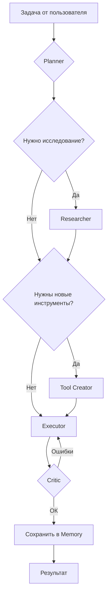
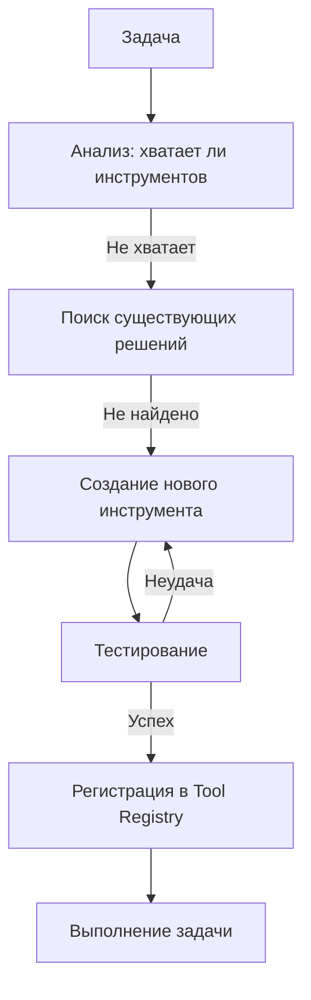

# Pyrfor Universal Engine — Vision & Architecture v0.1

**Статус:** Документ для обсуждения и итераций  
**Дата:** 11 мая 2026  
**Автор:** Claude (Main)  
**Цель:** Определить архитектуру универсального самообучающегося мультиагентного ядра, способного выполнять любые сложные задачи «под ключ».

---

## 1. Executive Summary

**Pyrfor Universal Engine** — это универсальное автономное мультиагентное ядро, которое:

- Принимает задачу в естественном языке (или структурированно)
- Самостоятельно исследует предметную область при необходимости
- Создаёт недостающие инструменты и навыки
- Планирует, выполняет, проверяет, исправляет ошибки
- Сохраняет стратегические знания и улучшает себя со временем
- Может работать как standalone-система и как встраиваемое ядро в другие продукты

**Ключевое отличие от существующих решений:**
Большинство инструментов (Cursor, Devin, Aider, AutoGen) либо узкоспециализированы, либо требуют значительной ручной настройки. Pyrfor Engine нацелен на **максимальную автономность + универсальность** при решении задач любой природы.

---

## 2. Vision & Основные Принципы

### 2.1. Видение

Pyrfor Engine — это **«цифровой коллега», способный брать сложную задачу и доводить её до результата с минимальным участием человека**, при этом постоянно развиваясь.

### 2.2. Принципы (HARD)

1. **Универсальность** — система не должна быть привязана к коду. Она работает с любыми задачами: код, проектирование, тексты, аналитика, бизнес-процессы и т.д.
2. **Автономность** — агент сам принимает решения, когда сталкивается с нехваткой информации или инструментов.
3. **Самообучение** — система способна создавать новые инструменты и сохранять полезные паттерны.
4. **Прозрачность и контроль** — все ключевые решения агента логируются, человек в любой момент может вмешаться или откатить.
5. **Безопасность** — создание и выполнение инструментов происходит в контролируемой среде.

---

## 3. Архитектура Высокого Уровня

```
┌─────────────────────────────────────────────────────────────────────┐
│                        Pyrfor Universal Engine                       │
├─────────────────────────────────────────────────────────────────────┤
│                                                                       │
│   ┌──────────────┐    ┌──────────────┐    ┌──────────────┐            │
│   │   Planner    │◄──►│   Memory     │◄──►│   Strategy   │            │
│   └──────┬───────┘    └──────┬───────┘    └──────┬───────┘            │
│          │                   │                   │                    │
│   ┌──────▼───────┐    ┌──────▼───────┐    ┌──────▼───────┐            │
│   │  Researcher  │    │  Executor    │    │    Critic    │            │
│   └──────┬───────┘    └──────┬───────┘    └──────┬───────┘            │
│          │                   │                   │                    │
│   ┌──────▼───────────────────▼───────────────────▼───────┐            │
│   │                  Tool Creation & Registry             │            │
│   └──────────────────────────────────────────────────────┘            │
│                                                                       │
│   ┌──────────────────────────────────────────────────────┐            │
│   │              Main Orchestration Loop                  │            │
│   └──────────────────────────────────────────────────────┘            │
│                                                                       │
└─────────────────────────────────────────────────────────────────────┘
```

---

## 4. Ключевые Компоненты

### 4.1. Planner
- Разложение задачи на подзадачи
- Выбор стратегии выполнения
- Определение недостающих инструментов/знаний

### 4.2. Researcher
- Поиск информации (web, документация, кодовые базы)
- Анализ предметной области
- Формирование контекста для Planner

### 4.3. Tool Creator
- Создание новых инструментов (код, скрипты, API-клиенты и т.д.)
- Тестирование и валидация созданных инструментов
- Регистрация в Tool Registry

### 4.4. Executor
- Выполнение задач и инструментов
- Работа с файловой системой, процессами, внешними API

### 4.5. Critic (Self-Reviewer)
- Проверка результатов
- Поиск ошибок и слабых мест
- Предложение улучшений

### 4.6. Memory System
- Краткосрочная (текущая сессия)
- Долгосрочная (проекты, стратегии, паттерны)
- Strategy Memory (цели, решения, «почему»)

### 4.7. Strategy Store
- Сохранение высокоуровневых целей и принципов пользователя
- Контекст «как мы обычно решаем задачи такого типа»

---

## 5. Основные Циклы Работы

### 5.1. Основной Цикл (Main Loop)



### 5.2. Цикл Самообучения (Self-Extension Loop)



---

## 6. Roadmap (4 фазы)

### Фаза 0 — Foundation (2–3 недели)
- Базовый Planner + Executor + простой Memory
- Первый работающий цикл на простых задачах
- Базовый Research (web search)

### Фаза 1 — Tool Creation & Self-Repair (3–4 недели)
- Tool Creator
- Critic + автоматическое исправление ошибок
- Strategy Memory (первые версии)

### Фаза 2 — Scaling & Universality (4–6 недель)
- Поддержка разных типов задач (не только код)
- Улучшенная долгосрочная память
- Первые эксперименты с самоулучшением

### Фаза 3 — Production & Embedding (6–8 недель)
- Стабильность и безопасность
- API для встраивания
- Интеграция с Tauri IDE (опционально)

---

## 7. Риски и Открытые Вопросы

- **Риск переусложнения** — нужно постоянно держать фокус на минимальном рабочем цикле.
- **Качество self-correction** — один из самых сложных элементов.
- **Стоимость и скорость** — автономные циклы могут быть дорогими.
- **Безопасность** — выполнение кода, созданного агентом.

---

## 8. Следующие Шаги

1. Обсудить этот документ с агентами (planner, evolutionist, historian, main-reviewer)
2. Получить обратную связь от Саши
3. Начать Фазу 0

---

*Документ v0.1 — базовая версия для обсуждения. Готов к итерациям.*