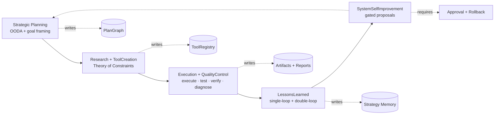
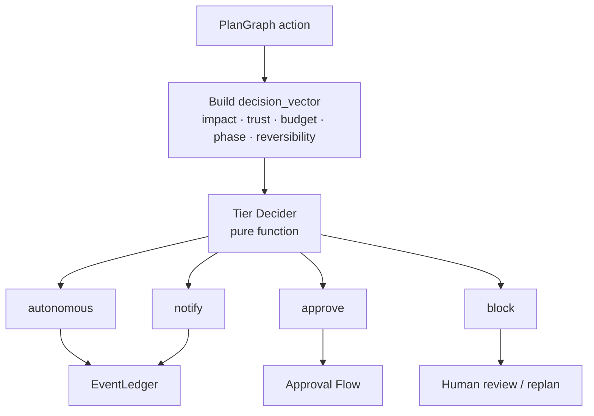

# 00.5 — Algorithmic Governance Layer

> ← [00 — Original Vision](./00-original-vision.md) · далее → [01 — Strategy & Goals](./01-strategy-and-goals.md)

---

## 0.5.1 Зачем нужен алгоритмический слой

Источник интеграции: [INTERNAL-COUNCIL-ALGORITHMIC-INTEGRATION.md](./INTERNAL-COUNCIL-ALGORITHMIC-INTEGRATION.md).

Текущая архитектура уже даёт сильную safety-базу: `PlanGraph`, `EventLedger`, `ArtifactStore`, `Tier Decider`, `Effect Gateway`, `Approval Flow`, sandbox tiers, verifier ensemble и ToolForge. Новый слой **не заменяет** эти механизмы и не создаёт второй control-plane.

**Algorithmic Governance Layer** — это управляющий meta-layer над фазами и агентами. Он задаёт:

- какой алгоритм управляет фазой;
- какие checkpoint'ы обязательны;
- когда цикл считается завершённым;
- когда нужен feedback loop, replan, approval или block;
- какой бюджет и tier допустимы для конкретного действия;
- какие уроки должны быть записаны после цикла.

Главная цель — сделать Universal Engine не просто автономным, а **алгоритмически дисциплинированным**: меньше хаотического research, меньше лишнего ToolForge, меньше повторных ошибок, больше доказуемого прогресса.

---

## 0.5.2 Пять управляющих алгоритмов



| Алгоритм | Где применяется | Основная идея | Главный выход |
|---|---|---|---|
| **Strategic Planning** | ConceptIntake, Clarification, DomainResearch, PlanSynthesis | OODA: observe → orient → decide → act; план строится только после явных допущений и критериев завершения | `plan_document`, `budget_profile`, `completion_criteria` |
| **Research + ToolCreation** | Research, Gap, Discovery, ToolForge | Theory of Constraints: устранять главный bottleneck, а не создавать инструменты «на всякий случай» | `capability_gap_report`, `tool_discovery_report`, `tool_capability_manifest` |
| **Execution + QualityControl** | Execute, Test, Verify, SelfHeal | Ограниченный цикл: execute → test → verify → diagnose → replan | `execution_result`, `acceptance_test_suite`, `verification_report`, `failure_classification` |
| **LessonsLearned** | После ToolForge, SelfHeal, PostMortem | Single-loop исправляет текущий дефект; double-loop предлагает изменить правило, эвристику или стратегию | `lessons_learned`, `algorithm_outcome` |
| **SystemSelfImprovement** | M15 и meta-improvement concepts | Самоулучшение только через verifier quorum, approval, eval proof и rollback | `governance_adjustment_proposal` |

---

### 0.5.2.1 Completion Gates (обязательные)

Каждый управляющий алгоритм имеет **Completion Gate** — минимальный набор артефактов и проверок, без которого цикл не может перейти в состояние `completed`. Если gate не выполнен, система обязана либо `block`, либо `escalate`; состояния «почти готово» в governance-модели нет.

| Алгоритм | Обязательный Completion Gate | Failure / escalation |
|---|---|---|
| **Strategic Planning (OODA)** | `plan_document`, `budget_profile`, `completion_criteria`, `assumptions` записаны в PlanGraph и прошли feasibility-check | Нет критериев успеха или допущения не зафиксированы → `block` |
| **Research + ToolCreation (TOC)** | `bottleneck_proof`; затем одно из: `reuse_analysis`, `adaptation_attempted`, `forge_justified`; для ToolForge — `tool_capability_manifest` signed + `tests_passed` + `taint_clean` | После 2 ToolForge попыток в одном cycle → human escalation |
| **Execution + QualityControl** | `execution_result`, `acceptance_test_suite`, `verification_report` от ≥2 независимых verifier'ов; при провале — `failure_classification` | Self-heal ограничен 3 циклами для actionable failure-классов; verifier_disagreement / external_dependency повторяются отдельным `verifierRetryBudget` (1–2) и не списываются с self-heal cap; исчерпание → `postmortem_report` + `lessons_learned` |
| **LessonsLearned** | Single-loop: `defect_fixed` + `root_cause`; Double-loop: `governance_adjustment_proposal`, если нужна правка алгоритма/policy | Создание proposal — автономно; **активация** — только через `ApprovalFlow` |
| **SystemSelfImprovement** | `governance_adjustment_proposal`, `eval_proof`, `rollback_plan`, human approval | Нет proof / rollback / approval → `block` |

### 0.5.2.2 Feedback Loop Termination Rules

Каждый feedback loop обязан иметь явный контракт остановки; циклы без верхней границы считаются нарушением governance.

```ts
interface FeedbackLoopContract {
  maxLoops: number;
  requiresNewEvidence: boolean;       // повтор того же действия без нового evidence запрещён
  escalationTriggers: string[];       // конкретные условия эскалации
  stopArtifactKind: string;           // какой артефакт обязан появиться при остановке
}

interface FeedbackStopReport {
  loopId: string;
  actualLoops: number;
  stopReason: 'max_loops' | 'escalation_trigger' | 'completion_gate_failed' | 'budget_exhausted';
  triggeredBy?: string;
  evidenceRefs: string[];
}
```

`budget_exhausted` имеет приоритет над `max_loops`: при исчерпании per-phase/per-algorithm/per-concept бюджета новый цикл не запускается, даже если `actualLoops < maxLoops`.

Пример контракта для `ToolForge`:

```json
{
  "maxLoops": 2,
  "requiresNewEvidence": true,
  "escalationTriggers": [
    "bottleneck_not_proven",
    "reuse_refused_without_justification",
    "taint_detected"
  ],
  "stopArtifactKind": "toolforge_cycle_report"
}
```

---

## 0.5.3 Инварианты слоя

1. **Meta-layer, не новый оркестратор.** Algorithmic Governance не обходит `UniversalEngineOrchestrator`; он добавляет контракты к узлам PlanGraph.
2. **Один источник истины.** Все checkpoint'ы, решения, выводы и уроки пишутся через `EventLedger` и `ArtifactStore`.
3. **Tier Decider остаётся детерминированным.** Context-aware не означает LLM-aware: входы явно перечислены и логируются как `decision_vector`.
4. **Safety precedence.** `block` > `approve` > budget > algorithm hint. Алгоритм не может понизить safety-tier.
5. **Ограниченные циклы.** У каждого feedback loop есть `max_loops`, escalation trigger и artifact с причиной остановки.
6. **No silent fallback.** Если sandbox/backend недоступен, действие блокируется или эскалируется; оно не запускается в менее безопасном tier.
7. **Double-loop только gated.** Изменение policy, budget, guardrails, trust ladder или verifier rules всегда оформляется как proposal и требует approval.

---

## 0.5.3.1 Decision Record (обязателен для consequential nodes)

Каждый узел PlanGraph уровня `consequential` обязан записывать `DecisionRecord` в `EventLedger` **до** начала исполнения. Это делает выбор объяснимым и запрещает значимые действия без зафиксированных альтернатив и принятого риска.

```ts
interface BudgetVector {
  estimatedTokens?: number;
  estimatedUsd?: number;
  estimatedWallMs?: number;
}

interface DecisionRecord {
  nodeId: string;
  nodeHash: string;                              // hash inputs+contract — anti-poisoning anchor
  algorithm: string;
  alternativesConsidered: string[];
  selectedAlternative: string;
  selectedToolVersion?: string;
  rationale: string;
  evidenceRefs: string[];                        // обязательно ≥1
  risksAccepted: string[];
  budgetImpact: BudgetVector;
  decisionVectorRef?: string;
  timestamp: string;
  author: 'system' | `agent:${string}` | 'human';
}
```

**Что считается consequential.** Любой узел с side effects, branching на план, бюджетным impact'ом, созданием/промоушеном инструмента, replan или approval. Дешёвые автономные узлы могут писать `DecisionRecordLite` (только `nodeId`, `nodeHash`, `selectedAlternative`, `evidenceRefs`, `templateId`), но обязательно до выполнения.

**Аудит-инварианты.**
1. Нет `*.started` события для consequential node без предшествующего `DecisionRecord`.
2. `DecisionRecord` без `evidenceRefs` или `nodeHash` считается невалидным.
3. `execution_started` событие ссылается на `decisionRecordId`.
4. Поздняя или осиротевшая запись = `audit.violation`.

Отсутствие валидного `DecisionRecord` для consequential node трактуется как governance violation и приводит к `TierDecider.block`.

**Legacy / migration.** Узлы старых run'ов без `governedByAlgorithm` не блокируются автоматически: они получают `algorithmCoverage: grandfathered` с дефолтным маппингом по фазе из 0.5.5 и логируют `governance.legacy_node` событие. Новые consequential nodes без алгоритма блокируются всегда.

---

## 0.5.4 Расширение контракта PlanGraph node

Каждый consequential node получает дополнительные governance-поля:

```ts
interface CompletionGate {
  requiredArtifacts: string[];
  successCriteria: string[];
  failureArtifact: string;
  onMissingArtifacts: 'block' | 'escalate' | 'postmortem';
}

interface AlgorithmicGovernanceContract {
  governedByAlgorithm:
    | 'strategic_planning'
    | 'research_tool_creation'
    | 'execution_quality_control'
    | 'lessons_learned'
    | 'system_self_improvement';
  checkpointPolicy: {
    requiredArtifacts: string[];
    maxLoops: number;
    escalationTriggers: string[];
  };
  completionGate: CompletionGate;
  feedbackContract: FeedbackLoopContract;
  decisionRecordRequired: boolean;
  completionCriteria: string[];
  feedbackPolicy: {
    onFailure: 'retry' | 'replan' | 'forge_tool' | 'escalate' | 'block';
    requiresNewEvidence: boolean;
  };
  budgetProfile: {
    tokens?: number;
    usd?: number;
    wallMs?: number;
    sideEffectTier?: 'none' | 'fs' | 'net_allowlist' | 'host';
  };
  bottleneckHypothesis?: string;
  lessonSink?: {
    writeLessons: boolean;
    lessonKind: 'run' | 'tool' | 'policy' | 'strategy';
  };
  algorithmCoverage?: 'declared' | 'inferred' | 'grandfathered';
}
```

Для consequential node `decisionRecordRequired` обязан быть `true`. `completionGate` и `feedbackContract` — обязательные поля того же контракта, а не внешняя metadata. Эти поля не должны жить в отдельной базе: они часть PlanGraph node spec и попадают в audit trail через `EventLedger`.

---

## 0.5.5 Phase → algorithm map

| Фаза | Управляющий алгоритм | Checkpoint | Feedback loop |
|---|---|---|---|
| ConceptIntake | Strategic Planning | цель нормализована; constraints извлечены | clarification или block при unsafe intent |
| Clarification | Strategic Planning | unresolved assumptions ≤ threshold | Q&A только при новом evidence |
| DomainResearch | Strategic Planning / Research + ToolCreation | источники с provenance; injection scan пройден | OODA re-orient, max 2 research loops без нового evidence |
| PlanSynthesis | Strategic Planning | PlanGraph имеет verifiers, budgets, completion criteria | replan при feasibility fail |
| CapabilityGapAnalysis | Research + ToolCreation | найден главный bottleneck | TOC-loop: reuse → adapt → forge |
| ToolDiscovery | Research + ToolCreation | discovery доказал отсутствие vetted alternative | re-run discovery только при новом source |
| ToolForge | Research + ToolCreation / LessonsLearned | manifest, tests, taint, dry-run | tool-level lesson обязателен при success и failure |
| SandboxedExecution | Execution + QualityControl | effect bounds соблюдены | diagnose: spec gap / tool gap / execution bug / verifier disagreement |
| TestSynthesis | Execution + QualityControl | tests executable; shape valid | regenerate tests только с failure reason |
| AcceptanceVerification | Execution + QualityControl | quorum + family diversity + executable verifier | self-heal или approval при disagreement |
| SelfHealLoop | Execution + QualityControl | новая immutable итерация PlanGraph | bounded by `max_rework_cycles` |
| DeliveryPackager | Execution + QualityControl | manifest + checksum | package fix или block |
| PostMortem | LessonsLearned | lessons with evidenceRefs | double-loop proposal, не direct write |
| Meta-improvement | SystemSelfImprovement | eval proof + rollback path | approval-gated canary |

---

## 0.5.6 Context-aware autonomy вместо глобального переключателя

Режим автономии становится не одним флагом `notify | approve | auto`, а **policy profile** поверх детерминированного Tier Decider:



**Рекомендуемый default:** `balanced-governance`.

- low-impact, reversible, sandboxed actions → `autonomous`;
- medium-impact или budget-sensitive actions → `notify`;
- new tool execution, policy changes, broad fs/net effects → `approve`;
- undeclared effects, missing sandbox, unsafe intent → `block`.

---

## 0.5.7 ToolForge Lessons Learned

Каждый ToolForge cycle, успешный или провалившийся, обязан создать `lessons_learned` artifact:

```ts
interface LessonsLearnedArtifact {
  scope: 'tool' | 'run' | 'policy' | 'strategy';
  whatWorked: string[];
  whatFailed: string[];
  rootCause:
    | 'spec_gap'
    | 'tool_gap'
    | 'execution_bug'
    | 'test_gap'
    | 'verifier_disagreement'
    | 'budget_or_tier'
    | 'external_dependency';
  algorithmOutcome: 'success' | 'partial' | 'failed_to_meet_criteria';
  bottleneckAddressed?: boolean;
  expectedImpact?: string;
  strategyDelta?: string;
  toolDelta?: string;
  policyProposal?: string;
  evidenceRefs: string[];
  confidence: 'low' | 'medium' | 'high';
}
```

`low` confidence остаётся в quarantine. Запись в Strategy Memory возможна только через Historian после PostMortem и verifier-confirmed evidence.

---

## 0.5.8 Связанные документы

- [01 — Strategy & Goals](./01-strategy-and-goals.md)
- [02 — Architecture](./02-architecture.md)
- [03 — Lifecycle](./03-lifecycle.md)
- [06 — Memory & Strategy](./06-memory-and-strategy.md)
- [10 — Roadmap & Milestones](./10-roadmap-milestones.md)
- [12 — Risks & Open Decisions](./12-risks-and-decisions.md)
