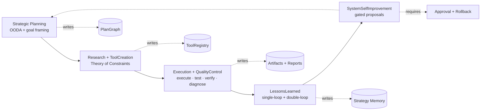
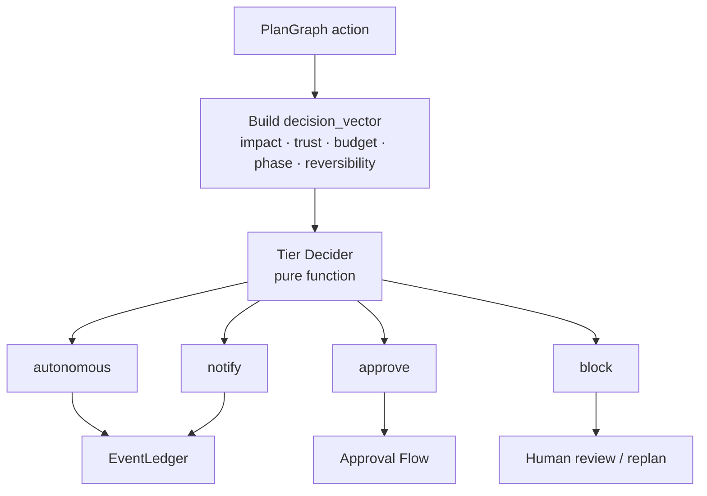

# 00.5 — Algorithmic Governance Layer

> ← [00 — Original Vision](./00-original-vision.md) · далее → [01 — Strategy & Goals](./01-strategy-and-goals.md)

---

## 0.5.1 Зачем нужен алгоритмический слой

Источник интеграции: [INTERNAL-COUNCIL-ALGORITHMIC-INTEGRATION.md](./INTERNAL-COUNCIL-ALGORITHMIC-INTEGRATION.md).

Текущая архитектура уже даёт сильную safety-базу: `PlanGraph`, `EventLedger`, `ArtifactStore`, `Tier Decider`, `Effect Gateway`, `Approval Flow`, sandbox tiers, verifier ensemble и ToolForge. Новый слой **не заменяет** эти механизмы и не создаёт второй control-plane.

**Algorithmic Governance Layer** — это управляющий meta-layer над фазами и агентами. Он задаёт:

- какой алгоритм управляет фазой;
- какие checkpoint'ы обязательны;
- когда цикл считается завершённым;
- когда нужен feedback loop, replan, approval или block;
- какой бюджет и tier допустимы для конкретного действия;
- какие уроки должны быть записаны после цикла.

Главная цель — сделать Universal Engine не просто автономным, а **алгоритмически дисциплинированным**: меньше хаотического research, меньше лишнего ToolForge, меньше повторных ошибок, больше доказуемого прогресса.

---

## 0.5.2 Пять управляющих алгоритмов



| Алгоритм | Где применяется | Основная идея | Главный выход |
|---|---|---|---|
| **Strategic Planning** | ConceptIntake, Clarification, DomainResearch, PlanSynthesis | OODA: observe → orient → decide → act; план строится только после явных допущений и критериев завершения | `plan_document`, `budget_profile`, `completion_criteria` |
| **Research + ToolCreation** | Research, Gap, Discovery, ToolForge | Theory of Constraints: устранять главный bottleneck, а не создавать инструменты «на всякий случай» | `capability_gap_report`, `tool_discovery_report`, `tool_capability_manifest` |
| **Execution + QualityControl** | Execute, Test, Verify, SelfHeal | Ограниченный цикл: execute → test → verify → diagnose → replan | `execution_result`, `acceptance_test_suite`, `verification_report`, `failure_classification` |
| **LessonsLearned** | После ToolForge, SelfHeal, PostMortem | Single-loop исправляет текущий дефект; double-loop предлагает изменить правило, эвристику или стратегию | `lessons_learned`, `algorithm_outcome` |
| **SystemSelfImprovement** | M15 и meta-improvement concepts | Самоулучшение только через verifier quorum, approval, eval proof и rollback | `governance_adjustment_proposal` |

---

### 0.5.2.1 Completion Gates (обязательные)

Каждый управляющий алгоритм имеет **Completion Gate** — минимальный набор артефактов и проверок, без которого цикл не может перейти в состояние `completed`. Если gate не выполнен, система обязана либо `block`, либо `escalate`; состояния «почти готово» в governance-модели нет.

| Алгоритм | Обязательный Completion Gate | Failure / escalation |
|---|---|---|
| **Strategic Planning (OODA)** | `plan_document`, `budget_profile`, `completion_criteria`, `assumptions` записаны в PlanGraph и прошли feasibility-check | Нет критериев успеха или допущения не зафиксированы → `block` |
| **Research + ToolCreation (TOC)** | `bottleneck_proof`; затем одно из: `reuse_analysis`, `adaptation_attempted`, `forge_justified`; для ToolForge — `tool_capability_manifest` signed + `tests_passed` + `taint_clean` | После 2 ToolForge попыток в одном cycle → human escalation |
| **Execution + QualityControl** | `execution_result`, `acceptance_test_suite`, `verification_report` от ≥2 независимых verifier'ов; при провале — `failure_classification` | Self-heal ограничен 3 циклами для actionable failure-классов; verifier_disagreement / external_dependency повторяются отдельным `verifierRetryBudget` (1–2) и не списываются с self-heal cap; исчерпание → `postmortem_report` + `lessons_learned` |
| **LessonsLearned** | Single-loop: `defect_fixed` + `root_cause`; Double-loop: `governance_adjustment_proposal`, если нужна правка алгоритма/policy | Создание proposal — автономно; **активация** — только через `ApprovalFlow` |
| **SystemSelfImprovement** | `governance_adjustment_proposal`, `eval_proof`, `rollback_plan`, human approval | Нет proof / rollback / approval → `block` |

### 0.5.2.2 Feedback Loop Termination Rules

Каждый feedback loop обязан иметь явный контракт остановки; циклы без верхней границы считаются нарушением governance.

```ts
interface FeedbackLoopContract {
  maxLoops: number;
  requiresNewEvidence: boolean;       // повтор того же действия без нового evidence запрещён
  escalationTriggers: string[];       // конкретные условия эскалации
  stopArtifactKind: string;           // какой артефакт обязан появиться при остановке
}

interface FeedbackStopReport {
  loopId: string;
  actualLoops: number;
  stopReason: 'max_loops' | 'escalation_trigger' | 'completion_gate_failed' | 'budget_exhausted';
  triggeredBy?: string;
  evidenceRefs: string[];
}
```

`budget_exhausted` имеет приоритет над `max_loops`: при исчерпании per-phase/per-algorithm/per-concept бюджета новый цикл не запускается, даже если `actualLoops < maxLoops`.

Пример контракта для `ToolForge`:

```json
{
  "maxLoops": 2,
  "requiresNewEvidence": true,
  "escalationTriggers": [
    "bottleneck_not_proven",
    "reuse_refused_without_justification",
    "taint_detected"
  ],
  "stopArtifactKind": "toolforge_cycle_report"
}
```

---

## 0.5.3 Инварианты слоя

1. **Meta-layer, не новый оркестратор.** Algorithmic Governance не обходит `UniversalEngineOrchestrator`; он добавляет контракты к узлам PlanGraph.
2. **Один источник истины.** Все checkpoint'ы, решения, выводы и уроки пишутся через `EventLedger` и `ArtifactStore`.
3. **Tier Decider остаётся детерминированным.** Context-aware не означает LLM-aware: входы явно перечислены и логируются как `decision_vector`.
4. **Safety precedence.** `block` > `approve` > budget > algorithm hint. Алгоритм не может понизить safety-tier.
5. **Ограниченные циклы.** У каждого feedback loop есть `max_loops`, escalation trigger и artifact с причиной остановки.
6. **No silent fallback.** Если sandbox/backend недоступен, действие блокируется или эскалируется; оно не запускается в менее безопасном tier.
7. **Double-loop только gated.** Изменение policy, budget, guardrails, trust ladder или verifier rules всегда оформляется как proposal и требует approval.

---

## 0.5.3.1 Decision Record (обязателен для consequential nodes)

Каждый узел PlanGraph уровня `consequential` обязан записывать `DecisionRecord` в `EventLedger` **до** начала исполнения. Это делает выбор объяснимым и запрещает значимые действия без зафиксированных альтернатив и принятого риска.

```ts
interface BudgetVector {
  estimatedTokens?: number;
  estimatedUsd?: number;
  estimatedWallMs?: number;
}

interface DecisionRecord {
  nodeId: string;
  nodeHash: string;                              // hash inputs+contract — anti-poisoning anchor
  algorithm: string;
  alternativesConsidered: string[];
  selectedAlternative: string;
  selectedToolVersion?: string;
  rationale: string;
  evidenceRefs: string[];                        // обязательно ≥1
  risksAccepted: string[];
  budgetImpact: BudgetVector;
  decisionVectorRef?: string;
  timestamp: string;
  author: 'system' | `agent:${string}` | 'human';
}
```

**Что считается consequential.** Любой узел с side effects, branching на план, бюджетным impact'ом, созданием/промоушеном инструмента, replan или approval. Дешёвые автономные узлы могут писать `DecisionRecordLite` (только `nodeId`, `nodeHash`, `selectedAlternative`, `evidenceRefs`, `templateId`), но обязательно до выполнения.

**Аудит-инварианты.**
1. Нет `*.started` события для consequential node без предшествующего `DecisionRecord`.
2. `DecisionRecord` без `evidenceRefs` или `nodeHash` считается невалидным.
3. `execution_started` событие ссылается на `decisionRecordId`.
4. Поздняя или осиротевшая запись = `audit.violation`.

Отсутствие валидного `DecisionRecord` для consequential node трактуется как governance violation и приводит к `TierDecider.block`.

**Legacy / migration.** Узлы старых run'ов без `governedByAlgorithm` не блокируются автоматически: они получают `algorithmCoverage: grandfathered` с дефолтным маппингом по фазе из 0.5.5 и логируют `governance.legacy_node` событие. Новые consequential nodes без алгоритма блокируются всегда.

---

## 0.5.4 Расширение контракта PlanGraph node

Каждый consequential node получает дополнительные governance-поля:

```ts
interface CompletionGate {
  requiredArtifacts: string[];
  successCriteria: string[];
  failureArtifact: string;
  onMissingArtifacts: 'block' | 'escalate' | 'postmortem';
}

interface AlgorithmicGovernanceContract {
  governedByAlgorithm:
    | 'strategic_planning'
    | 'research_tool_creation'
    | 'execution_quality_control'
    | 'lessons_learned'
    | 'system_self_improvement';
  checkpointPolicy: {
    requiredArtifacts: string[];
    maxLoops: number;
    escalationTriggers: string[];
  };
  completionGate: CompletionGate;
  feedbackContract: FeedbackLoopContract;
  decisionRecordRequired: boolean;
  completionCriteria: string[];
  feedbackPolicy: {
    onFailure: 'retry' | 'replan' | 'forge_tool' | 'escalate' | 'block';
    requiresNewEvidence: boolean;
  };
  budgetProfile: {
    tokens?: number;
    usd?: number;
    wallMs?: number;
    sideEffectTier?: 'none' | 'fs' | 'net_allowlist' | 'host';
  };
  bottleneckHypothesis?: string;
  lessonSink?: {
    writeLessons: boolean;
    lessonKind: 'run' | 'tool' | 'policy' | 'strategy';
  };
  algorithmCoverage?: 'declared' | 'inferred' | 'grandfathered';
}
```

Для consequential node `decisionRecordRequired` обязан быть `true`. `completionGate` и `feedbackContract` — обязательные поля того же контракта, а не внешняя metadata. Эти поля не должны жить в отдельной базе: они часть PlanGraph node spec и попадают в audit trail через `EventLedger`.

---

## 0.5.5 Phase → algorithm map

| Фаза | Управляющий алгоритм | Checkpoint | Feedback loop |
|---|---|---|---|
| ConceptIntake | Strategic Planning | цель нормализована; constraints извлечены | clarification или block при unsafe intent |
| Clarification | Strategic Planning | unresolved assumptions ≤ threshold | Q&A только при новом evidence |
| DomainResearch | Strategic Planning / Research + ToolCreation | источники с provenance; injection scan пройден | OODA re-orient, max 2 research loops без нового evidence |
| PlanSynthesis | Strategic Planning | PlanGraph имеет verifiers, budgets, completion criteria | replan при feasibility fail |
| CapabilityGapAnalysis | Research + ToolCreation | найден главный bottleneck | TOC-loop: reuse → adapt → forge |
| ToolDiscovery | Research + ToolCreation | discovery доказал отсутствие vetted alternative | re-run discovery только при новом source |
| ToolForge | Research + ToolCreation / LessonsLearned | manifest, tests, taint, dry-run | tool-level lesson обязателен при success и failure |
| SandboxedExecution | Execution + QualityControl | effect bounds соблюдены | diagnose: spec gap / tool gap / execution bug / verifier disagreement |
| TestSynthesis | Execution + QualityControl | tests executable; shape valid | regenerate tests только с failure reason |
| AcceptanceVerification | Execution + QualityControl | quorum + family diversity + executable verifier | self-heal или approval при disagreement |
| SelfHealLoop | Execution + QualityControl | новая immutable итерация PlanGraph | bounded by `max_rework_cycles` |
| DeliveryPackager | Execution + QualityControl | manifest + checksum | package fix или block |
| PostMortem | LessonsLearned | lessons with evidenceRefs | double-loop proposal, не direct write |
| Meta-improvement | SystemSelfImprovement | eval proof + rollback path | approval-gated canary |

---

## 0.5.6 Context-aware autonomy вместо глобального переключателя

Режим автономии становится не одним флагом `notify | approve | auto`, а **policy profile** поверх детерминированного Tier Decider:



**Рекомендуемый default:** `balanced-governance`.

- low-impact, reversible, sandboxed actions → `autonomous`;
- medium-impact или budget-sensitive actions → `notify`;
- new tool execution, policy changes, broad fs/net effects → `approve`;
- undeclared effects, missing sandbox, unsafe intent → `block`.

---

## 0.5.7 ToolForge Lessons Learned

Каждый ToolForge cycle, успешный или провалившийся, обязан создать `lessons_learned` artifact:

```ts
interface LessonsLearnedArtifact {
  scope: 'tool' | 'run' | 'policy' | 'strategy';
  whatWorked: string[];
  whatFailed: string[];
  rootCause:
    | 'spec_gap'
    | 'tool_gap'
    | 'execution_bug'
    | 'test_gap'
    | 'verifier_disagreement'
    | 'budget_or_tier'
    | 'external_dependency';
  algorithmOutcome: 'success' | 'partial' | 'failed_to_meet_criteria';
  bottleneckAddressed?: boolean;
  expectedImpact?: string;
  strategyDelta?: string;
  toolDelta?: string;
  policyProposal?: string;
  evidenceRefs: string[];
  confidence: 'low' | 'medium' | 'high';
}
```

`low` confidence остаётся в quarantine. Запись в Strategy Memory возможна только через Historian после PostMortem и verifier-confirmed evidence.

---

## 0.5.8 Enforcement: Completion Gate Engine

Completion Gates перестают быть «таблицей в документе» — они становятся runtime-объектами. Orchestrator обязан вызывать `CompletionGateEngine.evaluate()` перед любой попыткой `dag.node.completed`. Без `disposition ∈ {passed, waived_by_approval}` — переход запрещён.

**Runtime ownership (M1):**

| Component | File | Owner | Trigger / writes |
|---|---|---|---|
| `CompletionGateEngine` | `packages/engine/src/runtime/universal/completion-gate-engine.ts` | Orchestrator / `DurableDag` hook | `DurableDag.completeNode()` invokes `beforeNodeComplete`; emits `governance.gate.checked` + `governance.gate.violation` |
| `beforeNodeComplete` hook | `packages/engine/src/runtime/durable-dag.ts` | DurableDag primitive | Optional synchronous hook in `DurableDagOptions`; blocks transition before `dag.node.completed` |
| Gate event types | `packages/engine/src/runtime/event-ledger.ts` | EventLedger | Adds `governance.gate.checked` and `governance.gate.violation` union members |
| Gate artifacts | `packages/engine/src/runtime/artifact-model.ts` | ArtifactStore | Adds `gate_check_report` and `feedback_stop_report` artifact kinds |

**Разделение admission vs completion gates.** `TOC-Gate` — это **admission gate** (запускает ToolForge). У ToolForge есть отдельный **completion gate**: signed `tool_capability_manifest` + `taint_clean` + `tests_passed` + `toolforge_cycle_report` + PostForge LessonsLearned. Один и тот же узел может пройти admission, но провалить completion — это разные события и разные счётчики попыток.

**Идемпотентность и replay.** Каждая оценка определяется `evidence_snapshot_hash = hash(contract_hash + sorted(artifact_refs) + sorted(approval_refs) + ledger_high_watermark_seq)`. Идентичный snapshot → идентичный результат. Повторная оценка без новых evidence/approval — `noop` (не эмитит дубликаты). Replay из EventLedger восстанавливает `GateReplayState` детерминированно.

**Retry-семантика.** Gate failure делится на:

- `failed_retryable` — отсутствуют артефакты, но позже могут появиться. Узел получает `awaiting_new_evidence`; следующая попытка валидна **только** при изменении `evidence_snapshot_hash`.
- `failed_terminal` — нарушены инварианты, которые не могут быть исправлены добавлением evidence (например, безопасностный блок). Требует ApprovalFlow для разблокировки или отказа узла.
- `waived_by_approval` — допустимо только для гейтов с `waivable: true`; safety/sandbox/taint gates никогда не waivable.

```ts
type GateDisposition = 'passed' | 'failed_retryable' | 'failed_terminal' | 'waived_by_approval';
type GateTrigger = 'completion_requested' | 'artifact_created' | 'approval_granted' | 'approval_denied' | 'manual_retry' | 'ledger_replay';
type GateViolationCode =
  | 'missing_artifact' | 'artifact_invalid' | 'criteria_unsatisfied'
  | 'out_of_sequence' | 'approval_required'
  | 'tool_cap_exhausted' | 'decision_record_invalid';

interface GateArtifactRequirement {
  kind: string;
  minCount?: number;
  mustBeSigned?: boolean;
  mustBeFromVerifierFamily?: string[];
  waivable?: boolean;
}

interface GateEvidenceSnapshot {
  artifactRefs: string[];
  approvalRefs: string[];
  artifactKinds: string[];
  contractHash: string;
  evidenceSnapshotHash: string;
  ledgerHighWatermarkSeq: number;
}

interface GateCheckEvent {
  type: 'governance.gate.checked';
  id: string; ts: string; seq: number;
  run_id: string; node_id: string;
  governed_algorithm: GovernedAlgorithm;
  gate_id: string;            // e.g. "toolforge.completion.v1"
  gate_kind: 'admission' | 'completion';
  gate_revision: number;
  trigger: GateTrigger;
  attempt: number;
  required_artifacts: GateArtifactRequirement[];
  present_artifact_refs: string[];
  missing_artifact_kinds: string[];
  success_criteria: string[];
  decision_vector_ref?: string;
  approval_state: 'none' | 'pending' | 'granted' | 'denied';
  disposition: GateDisposition;
  retryable: boolean;
  evidence_snapshot_hash: string;
  contract_hash: string;
  supersedes_check_event_id?: string;
}

interface GateViolationEvent {
  type: 'governance.gate.violation';
  id: string; ts: string; seq: number;
  run_id: string; node_id: string;
  gate_id: string;
  gate_check_event_id: string;
  attempt: number;
  violation_code: GateViolationCode;
  reason: string;
  retryable: boolean;
  requires_new_evidence: boolean;
  accepted_new_evidence_kinds: string[];
  reopen_on_approval: boolean;
  blocked_completion: boolean;
}

interface CompletionGateEngine {
  evaluate(input: GateEvaluationInput): Promise<GateEvaluation>;
  replay(events: ReadonlyArray<GateCheckEvent | GateViolationEvent>): Map<string, GateReplayState>;
  isDuplicateEvaluation(input: GateEvaluationInput, prior?: GateReplayState): boolean;
}
```

**Orchestrator hook.**

```ts
type BeforeNodeCompleteResult =
  | { disposition: 'allow_complete'; gate: GateEvaluation }
  | { disposition: 'await_new_evidence'; gate: GateEvaluation; awaitingArtifactKinds: string[] }
  | { disposition: 'escalate_approval'; gate: GateEvaluation; reason: string }
  | { disposition: 'block_terminal'; gate: GateEvaluation; reason: string };

interface UniversalEngineOrchestratorGovernanceHook {
  beforeNodeComplete(ctx: BeforeNodeCompleteContext): Promise<BeforeNodeCompleteResult>;
}
```

**Бюджеты и gate.** Сама проверка gate **не списывает** execution/self-heal budget. Уже выполненная работа узла не возвращается. Если gate провалился — `gate_failed` имеет приоритет в DecisionVector выше `tool_cap_exhausted` и `approve`, но ниже `safety_block`.

**Инварианты enforcement:**

1. Нет `dag.node.completed` без предшествующего `governance.gate.checked` с `disposition ∈ {passed, waived_by_approval}` для соответствующего `gate_id` и текущего `attempt`.
2. Нет `governance.gate.checked.passed` без всех required artifacts, присутствующих в `evidence_snapshot`.
3. Нет `dag.node.started` для consequential node без валидного `DecisionRecord`.
4. Дубликат evaluation с тем же `evidence_snapshot_hash` не эмитит новые события.
5. `waived_by_approval` фиксирует `approvalRef` и `waiver_scope` (список конкретных требований, которые approval покрыл) — никаких неявных waivers.

## 0.5.9 Lessons Layering: Single-Loop, Double-Loop, Strategy Memory

`LessonsLearnedArtifact` остаётся **сырым postmortem-артефактом**. Над ним Historian формирует два производных типа записей. В Strategy Memory попадают **только approved DoubleLoop** или distilled SingleLoop с подтверждённой повторяемостью.

**Runtime ownership (M1/M13):**

| Component | File | Owner | Trigger / writes |
|---|---|---|---|
| `Historian.distill()` / `distillLessons()` | `packages/engine/src/runtime/universal/historian.ts` | Historian | PostMortem / ToolForge lessons; transforms raw `LessonsLearnedArtifact` into `SingleLoopRecord` and optional `DoubleLoopRecord` |
| `SingleLoopRecord` / `DoubleLoopRecord` / `LessonsQuery` | `packages/engine/src/runtime/universal/memory/types.ts` | Memory layer | Shared contracts for StrategyMemory and DecisionRecord provenance |
| `StrategyMemoryProvider` | `packages/engine/src/runtime/universal/memory/strategy-memory-provider.ts` | Historian writes; Strategist/ToolForger read | `prefetch()` prioritizes approved DoubleLoop before distilled single-loop / episodic fallbacks |
| `AlgorithmAwareRetriever` | `packages/engine/src/runtime/universal/memory/algorithm-aware-retriever.ts` | Strategist / ToolForger | Applicability filter first: `algorithm + phase + nodeKind + ruleKey`, then rank by impact/confidence/recency |

```ts
type LessonRootCause =
  | 'spec_gap' | 'tool_gap' | 'execution_bug'
  | 'test_gap' | 'verifier_disagreement'
  | 'budget_or_tier' | 'external_dependency';

type LessonProvenance = 'native' | 'legacy' | 'imported';
type NodeKind = 'consequential' | 'autonomous' | 'toolforge' | 'verification' | 'legacy';

interface LessonContext {
  runId: string; conceptId?: string;
  nodeId: string; nodeHash: string;
  algorithm: GovernedAlgorithm;
  phase: string;            // EnginePhase
  nodeKind: NodeKind;
  toolName?: string; toolVersion?: string;
}

interface LessonImpactVector {
  predictedScore?: number;
  observedScore?: number;
  costDeltaUsd?: number;
  latencyDeltaMs?: number;
  successRateDelta?: number;
  verifierPassRateDelta?: number;
  riskDelta?: 'lower' | 'same' | 'higher';
}

interface BaseLessonRecord {
  id: string;
  kind: 'single_loop' | 'double_loop';
  provenance: LessonProvenance;
  confidence: 'low' | 'medium' | 'high';
  context: LessonContext;
  sourceLessonsArtifactRef: string;
  evidence: Array<{ artifactRef: string; verifierConfirmed: boolean; verifierRefs?: string[] }>;
  createdAt: string;
  author: 'historian' | 'meta_critic' | `agent:${string}`;
}

interface SingleLoopRecord extends BaseLessonRecord {
  kind: 'single_loop';
  defectRootCause: LessonRootCause;
  defectSignature: string;          // dedup/cluster key
  fixApplied: string;
  fixType: 'replan' | 'refactor' | 'tool_retry' | 'tool_swap' | 'test_rewrite' | 'spec_clarification';
  algorithmOutcome: 'improved' | 'neutral' | 'worsened';
  reusablePattern?: string;
  localOnly: boolean;               // default true
  eligibleForStrategyDistillation: boolean;
}

type DoubleLoopStatus = 'candidate' | 'pending_approval' | 'approved' | 'rejected' | 'quarantined' | 'superseded';

interface DoubleLoopRecord extends BaseLessonRecord {
  kind: 'double_loop';
  proposedChangeType: 'algorithm' | 'heuristic' | 'policy' | 'budget' | 'verifier_rules';
  targetScope: {
    algorithm?: GovernedAlgorithm;
    phase?: string;
    nodeKind?: NodeKind;
    ruleKey: string;                // e.g. "tier-decider.approve.open-net"
    currentRule: string;
    proposedRule: string;
  };
  systemicDefect: string;
  expectedImpact: string;
  impact: LessonImpactVector;
  risks: string[];
  rollbackPlan: string;
  approvalFlowRef?: string;
  status: DoubleLoopStatus;
  rejectionReason?: string;
  supersedesRecordId?: string;
  similarityKey: string;            // anti-thrash fingerprint
  requiresNovelEvidenceAfterRejection: boolean;
}
```

**Чтение уроков (LessonsQuery).** Recency + impact_score недостаточно. Сначала фильтруем по применимости (algorithm, phase, nodeKind, ruleKey), затем ранжируем.

```ts
interface LessonsQuery {
  kinds?: Array<'single_loop' | 'double_loop'>;
  statuses?: DoubleLoopStatus[];           // Strategist/ToolForger default: ['approved']
  algorithms?: GovernedAlgorithm[];
  phases?: string[];
  nodeKinds?: NodeKind[];
  rootCauses?: LessonRootCause[];
  proposedChangeTypes?: DoubleLoopRecord['proposedChangeType'][];
  provenance?: LessonProvenance[];         // governance default: exclude 'legacy'
  ruleKeys?: string[];
  minConfidence?: 'low' | 'medium' | 'high';
  minObservedImpactScore?: number;
  newerThan?: string;
  limit: number;
  rankBy?: Array<'applicability' | 'observed_impact' | 'confidence' | 'recency'>;
  includeRejectedForAntiThrash?: boolean;
}
```

**Обязательное чтение перед PlanSynthesis и ToolForge.** Strategist и ToolForger получают ≥1 `LessonsQuery` и пишут в `DecisionRecord.lessonsConsidered` фактическое влияние:

```ts
interface LessonDecisionImpact {
  lessonId: string;
  lessonSnapshotHash: string;              // запись неизменяема для аудита
  disposition: 'followed' | 'adapted' | 'rejected_as_not_applicable' | 'overridden';
  affectedAlternatives?: string[];
  changedSelectedAlternative: boolean;
  impactSummary: string;                   // что именно изменилось в выборе
}
```

Доказательством «урок учтён» считается не присутствие ID, а наличие `LessonDecisionImpact` с непустым `impactSummary` и хотя бы одной `disposition` помимо `rejected_as_not_applicable` для применимых уроков.

**Rejected DoubleLoop и анти-трэш.** Отклонённые `DoubleLoopRecord` остаются доступны для Historian / Meta-critic, но не для Strategist/ToolForger по умолчанию. Похожее предложение (тот же `similarityKey`) после rejection требует **либо** новое verifier-confirmed evidence, **либо** материально изменённое `proposedRule`, **либо** истечения cooldown + свежего failure-cluster. Это исключает циклическое перевнесение тех же предложений.

**Migration LessonsLearnedArtifact → SingleLoop/DoubleLoop.** Существующие артефакты не переписываются in-place. Backfill scan: явные local fixes → `SingleLoopRecord`; систематические policy/budget/verifier deltas → `DoubleLoopRecord(status='candidate' | 'quarantined')`; ничего не получает `approved` автоматически. Legacy-источники получают `provenance: 'legacy'`.

## 0.5.10 Legacy Grandfathering: reproducible eligibility + bounded scope

Дата cut-off (`legacy_mode_enabled_until`) слаба: clock-spoof или поздняя миграция превращают её в дыру. Заменяется **репродуцируемым git-tagged baseline manifest**.

**Runtime ownership (M1/M15):**

| Component | File | Owner | Trigger / writes |
|---|---|---|---|
| `LegacyEligibilityProof` / `GrandfatheringScope` | `packages/engine/src/runtime/universal/legacy-node-auditor.ts` | Governance substrate | Validates baseline-manifest eligibility for any `governance.legacy_node` |
| `LegacyNodeAuditReport` | `packages/engine/src/runtime/universal/legacy-node-auditor.ts` | Meta-critic / SystemSelfImprovement | Generated on every `system_self_improvement` cycle and immediately on invalid legacy-node event |
| Legacy audit event | `packages/engine/src/runtime/event-ledger.ts` | EventLedger | `governance.legacy_node_audit.generated` with artifact ref and violation count |

```ts
interface LegacyEligibilityProof {
  nodeHash: string;
  baselineTag: string;                   // e.g. "ue-governance-baseline-m1"
  baselineCommit: string;
  baselineManifestArtifactRef: string;   // подписанный manifest со списком nodeHash
  firstSeenEventId: string;
  firstSeenAt: string;
}
```

Узел может быть `grandfathered` **только если** его `nodeHash` присутствует в подписанном baseline manifest, привязанном к git-tag. Тег проверяем из EventLedger + git, без доверия к wall-clock.

**Grandfathering scope (что именно можно обходить).**

```ts
type GrandfatherableGate =
  | 'algorithm_declared'
  | 'decision_record_required'
  | 'completion_gate_presence'
  | 'feedback_contract_presence'
  | 'phase_algorithm_mapping_inferred'
  | 'lesson_sink_required';

type NeverGrandfatheredGate =
  | 'unsafe_intent_block'
  | 'declared_effects_enforcement'
  | 'sandbox_tier_assignment'
  | 'taint_scan'
  | 'prompt_injection_scan'
  | 'approval_for_policy_change'
  | 'approval_for_budget_change'
  | 'kill_switch';

interface GrandfatheringScope {
  bypasses: GrandfatherableGate[];
  neverBypassed: NeverGrandfatheredGate[];        // фиксированный policy-set
  blocksDoubleLoopParticipation: true;
  blocksSystemSelfImprovementParticipation: true;
  emittedLessonProvenance: 'legacy';
  allowsGovernanceProposalEmission: false;
}
```

Полный grandfathering узла запрещён — обходимы только перечисленные `GrandfatherableGate`. Safety / sandbox / taint / kill-switch / approval-for-policy-change **никогда** не waivable, даже для legacy.

**Legacy lessons.** Legacy-узел может писать `LessonsLearnedArtifact`, но Historian обязан установить `provenance: 'legacy'`. Такие записи исключены из default `LessonsQuery` для Strategist/ToolForger и не могут породить `governance_adjustment_proposal`.

**LegacyNodeAuditReport.**

```ts
interface LegacyNodeAuditReport {
  id: string;
  periodStart: string; periodEnd: string;
  baselineTag: string;
  generatedAt: string;
  totalGrandfatheredNodes: number;
  activeGrandfatheredNodes: number;
  byPhase: Record<string, number>;
  byBypassedGate: Record<GrandfatherableGate, number>;
  neverGrandfatheredViolations: Array<{ nodeId: string; nodeHash: string; gate: NeverGrandfatheredGate; eventRef: string }>;
  highRiskNodes: Array<{ nodeId: string; nodeHash: string; phase: string; bypasses: GrandfatherableGate[]; sideEffectCount: number; lastSeenAt: string }>;
  legacyLessonsEmitted: number;
  governanceProposalsSuppressed: number;
  migrationCandidates: Array<{ nodeId: string; nodeHash: string; recommendedActions: string[]; priority: 'low' | 'medium' | 'high' }>;
}
```

Отчёт генерируется при каждом `system_self_improvement` цикле и при любом `governance.legacy_node` событии вне baseline manifest (последнее = `block` + escalation, потому что нарушает eligibility-инвариант).

## 0.5.11 DecisionRecord poisoning: canonical + suspicion signals

Чистый count-limit (`maxDecisionRecordsPerNode = 5`) обходится тривиально. Заменяется моделью **canonical record + suspicion score**.

**Runtime ownership (M1):**

| Component | File | Owner | Trigger / writes |
|---|---|---|---|
| `DecisionRecordAuditor` / scorer | `packages/engine/src/runtime/universal/decision-record-auditor.ts` | Governance substrate | Called when a DecisionRecord is created or superseded; pure deterministic scoring, no LLM |
| Audit artifact | `packages/engine/src/runtime/artifact-model.ts` | ArtifactStore | `decision_record_audit` stores canonical/quarantine/block result and signal list |
| Audit event | `packages/engine/src/runtime/event-ledger.ts` | EventLedger | `decision_record.audit.generated` points to audit artifact and includes signal codes / disposition |

**Canonical правило.** На один `(nodeId, attempt)` допускается **одна** канонический `DecisionRecord`. Дополнительные допустимы только как:

- **superseding** запись с новым evidence до `dag.node.started` (через `supersedesDecisionId`-цепочку), или
- запись для нового attempt / нового DAG node.

Если canonical валиден, подозрительные дополнительные записи помещаются в `quarantine` и **не блокируют узел** (но фиксируются для аудита). Если canonical отсутствует/невалиден — `gate_failed` (`decision_record_invalid`).

**Suspicion signals.**

```ts
type DecisionPoisonSignalCode =
  | 'duplicate_evidence_set'
  | 'near_duplicate_rationale'
  | 'low_rationale_entropy'
  | 'conflicting_same_node_hash'
  | 'budget_inflation_without_new_evidence'
  | 'out_of_sequence_write'
  | 'excessive_records_without_progress';

interface DecisionPoisonSignal { code: DecisionPoisonSignalCode; score: number; details?: string; }

interface DecisionRecordAssessment {
  canonical: boolean;
  quarantined: boolean;
  block: boolean;             // true только при отсутствии canonical valid record
  signals: DecisionPoisonSignal[];
}
```

Признаки tamper / противоречащих authoritative записей (`conflicting_same_node_hash` с обоими валидными canonical-кандидатами) → `safety_block`, а не просто `gate_failed`.

## 0.5.12 Verifier retry budget — scope

`verifierRetryBudget` (1–2) **покрывает только** `verifier_disagreement` и `external_dependency_failed`. Он **не покрывает**: `gate_failed`, `safety_block`, `tool_cap_exhausted`, `decision_record_invalid` — эти классы требуют либо новой evidence через retryable gate, либо approval/escalation, и не списываются с verifier-budget.

---

## 0.5.13 Связанные документы

- [01 — Strategy & Goals](./01-strategy-and-goals.md)
- [02 — Architecture](./02-architecture.md)
- [03 — Lifecycle](./03-lifecycle.md)
- [06 — Memory & Strategy](./06-memory-and-strategy.md)
- [10 — Roadmap & Milestones](./10-roadmap-milestones.md)
- [12 — Risks & Open Decisions](./12-risks-and-decisions.md)
