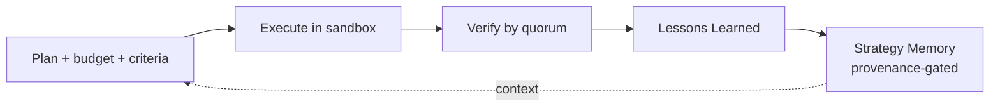

# 01 — Стратегия и цели

> ← [README](./README.md) · далее → [02 — Architecture](./02-architecture.md)

---

## 1.1 Стратегическое видение

**Pyrfor Universal Engine** — это «цифровой коллега», способный взять задачу любой природы и довести её до **полностью рабочего, протестированного, проверенного и упакованного результата**, при этом:

- автономно исследует предметную область,
- автономно подбирает существующие инструменты,
- автономно создаёт новые инструменты, когда подходящих нет,
- автономно проверяет результат через независимые верификаторы,
- автономно исправляет ошибки в ограниченных циклах,
- сохраняет полученный опыт в стратегической памяти,
- остаётся аудируемым, контролируемым и безопасным.

---

## 1.2 Принципы (HARD)

1. **Универсальность через контракт.** Любая задача — будь то код, текст, аналитика или бизнес-процесс — проходит через единый PlanGraph. Доменные знания живут в Strategy Memory и в Capabilities инструментов, а не в самом ядре.
2. **Каждый шаг — узел с провенансом.** Никаких free-form циклов. Каждое действие — узел `DurableDag` с декларированными входами, выходами, верификаторами и неизменяемым следом в `EventLedger` + `ArtifactStore`.
3. **Автономия — это бюджет.** На каждый run назначается бюджет (turns / tokens / USD / impact). При превышении тира действия — `approval-flow` запрос.
4. **Инструменты — управляемые граждане.** Capability Manifest, sandbox-tier, тестовый набор, signed provenance, trust ladder, per-tool бюджеты, автоматическая эвикция.
5. **Верификация — независимый кворум.** ≥2 верификатора на консеквентных узлах, как минимум один исполняемый (тесты, property-checks, differential).
6. **Алгоритмическая дисциплина важнее интеллекта.** Интеллект агента работает только внутри границ алгоритма. Если для нового consequential node не определены `governedByAlgorithm`, `completionGate`, `feedbackContract` и `decisionRecordRequired`, узел не может стартовать и получает решение `TierDecider.block`. Узлы из старых run'ов получают `algorithmCoverage: grandfathered` с дефолтным маппингом по фазе и логируют событие `governance.legacy_node` — это не silent fallback, а явная пометка для миграции.
7. **Самоулучшение — gated и обратимое.** Meta-critic предлагает улучшения; они проходят полный цикл (verifier quorum + tier decider + approval). Любое изменение откатываемо через RunLedger snapshots.
8. **Один источник истины.** PlanGraph + EventLedger + ArtifactStore. Агенты общаются ТОЛЬКО через события и узлы.
9. **Reuse > Extend > Invent.** Сначала переиспользуем существующие модули Pyrfor, потом расширяем, и только в последнюю очередь добавляем новые.

---

## 1.3 Algorithmic Foundation Principles

> Подробно: [00.5 — Algorithmic Governance](./00.5-algorithmic-governance.md)

1. **Feedback Loop by default.** Любой consequential step имеет явный feedback loop: что делать при failure, сколько итераций допустимо, какой artifact объясняет остановку.
2. **One Source of Truth.** Алгоритмы не создают shadow-state. Их checkpoint'ы, выводы и уроки живут в PlanGraph + EventLedger + ArtifactStore.
3. **Gated Self-Improvement.** Lessons Learned могут предлагать изменение стратегий, ToolForge-эвристик или policy, но не применяют их напрямую.
4. **Context-Aware Budgeting.** Автономия определяется не глобальным переключателем, а decision-vector: phase, reversibility, sandbox tier, tool trust, failure history, fs/net impact, remaining budget.
5. **Verifiable Progress.** Каждая фаза завершается только при выполнении completion criteria и наличии проверяемого artifact; "кажется готово" не является состоянием системы.

---

## 1.4 Цели v1 (что должно работать)

- ✅ Принять задачу в свободной форме через CLI / HTTP / VS Code и нормализовать её в `concept_record`.
- ✅ Выполнить интерактивный цикл уточнения (Clarification) с пользователем.
- ✅ Сгенерировать план как PlanGraph с декларированными узлами и верификаторами.
- ✅ Каждый consequential `PlanGraph` node имеет `governedByAlgorithm`, `checkpointPolicy`, `completionGate`, `feedbackContract`, `decisionRecordRequired`, `completionCriteria` и `budgetProfile`; для каждого consequential узла записан валидный `DecisionRecord` ДО исполнения.
- ✅ `ToolForge` управляется алгоритмом `Research + ToolCreation` с обязательным `TOC-Gate` (4 артефакта), обязательным `PostForge LessonsLearned` и ограничением v1: не более **2 новых executable-инструментов** (`non-adapter`) за один `concept_run` (адаптеры и manifest-only entries не считаются).
- ✅ Выполнить план в sandbox-окружениях с разделением tier'ов (`wasm` → `container_no_net` → `net_allowlist` → `container_full` → `host`).
- ✅ Синтезировать acceptance-тесты и пропустить результат через verifier-ensemble.
- ✅ Запустить ограниченный self-heal цикл при провале верификации.
- ✅ Упаковать результат (`delivery_bundle`) с manifest+checksum.
- ✅ Записать Lessons Learned и стратегические выводы в Strategy Memory с провенансом и double-loop gate.
- ✅ Сохранить полную аудит-цепочку и поддержать resume-from-node + rollback.

---

## 1.5 Non-goals (что НЕ делаем в v1)

- ❌ Не заменяем человеческое суждение по новым high-stakes решениям дизайна.
- ❌ Не делаем неконтролируемый production-deploy (production-релиз всегда human-tier approval).
- ❌ Не выполняем произвольный код вне sandbox-tier'ов.
- ❌ Не повышаем инструмент до `trusted` или `core` без human-approval.
- ❌ Не модифицируем guardrails / budgets / approval thresholds автономно.
- ❌ Не объединяем верификаторов одного семейства моделей как «независимых».
- ❌ Не создаём второй governance-store, scheduler или "совет агентов" вне PlanGraph/EventLedger.

---

## 1.6 Ключевые отличия от существующих решений

| Решение | Что делает хорошо | Что не закрывает |
|---|---|---|
| **Cursor / Aider / Claude Code** | редактирование кода под контролем человека | автономный жизненный цикл, синтез инструментов, верификация |
| **Devin / OpenHands / SWE-agent** | автономный код-агент | универсальность за пределами кода, governance, синтез инструментов |
| **AutoGPT / BabyAGI** | свободный agent loop | стабильность, safety, верификация, провенанс |
| **AutoGen / CrewAI / MetaGPT** | мультиагентные оркестрации | durable PlanGraph, sandbox tier'ы, ToolForge с safety |
| **LangGraph / Temporal / Restate** | durable execution | LLM-агентная логика, Tool synthesis, верификация |
| **Voyager** | skill library с автокурсом | governance, sandbox, верификация |
| **Pyrfor Universal Engine** | **всё перечисленное под единым governance с PlanGraph + Verifier Ensemble + Effect Gateway** | — |

---

## 1.7 Метрики успеха v1

- 🎯 **End-to-end success rate** на тестовом наборе разнодоменных концепций ≥ baseline (определяется eval-suite в M17).
- 🎯 **Verifier independence rate** — доля узлов, где ≥2 верификатора разных семейств → 100% на консеквентных узлах.
- 🎯 **Tool synthesis safety** — 0 инцидентов выхода инструмента за объявленные effects (taint scan + dynamic dry-run).
- 🎯 **Rollback coverage** — для каждой фазы есть snapshot, тест resume-from-node проходит.
- 🎯 **Audit completeness** — каждое действие на EventLedger; каждый artifact content-addressed; каждое approval-решение persisted.
- 🎯 **Tool reuse rate** — рост доли reuse/adapt над forge благодаря Theory of Constraints и procedural memory.
- 🎯 **Rework loop reduction** — снижение повторных self-heal итераций по одной root cause после внедрения Lessons Learned.
- 🎯 **Bottleneck resolution latency** — главный bottleneck фазы выявляется и закрывается без расползания в unrelated work.
- 🎯 **Verifier disagreement rate** — спорные verdict'ы классифицируются и приводят к replan/approval, а не к silent pass.
- 🎯 **Zero regression** на FreeClaude execution mode (вся работа аддитивна, под feature flag до M17).
