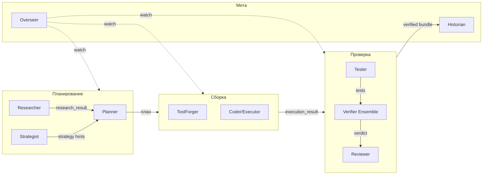

# 04 — Мультиагентная топология

> ← [03 — Lifecycle](./03-lifecycle.md) · далее → [05 — Tool Model](./05-tool-model.md)

---

## 4.1 Принципы координации

- **Один источник истины:** PlanGraph (узлы `DurableDag`) + EventLedger.
- **Stateless workers:** агенты не имеют долгосрочного состояния — забирают узлы из DAG, читают/пишут артефакты.
- **Никаких приватных каналов:** межагентная коммуникация только через события и артефакты.
- **Детерминированный tie-breaker:** при конфликте — победитель `agent_id` лексикографически меньший; повторяющийся конфликт → `approval` request.
- **Жёсткий turn-budget на узел:** защита от infinite consultation.

---

## 4.2 Реестр агентов

---

## 4.3 Контракты агентов

| Агент | Роль | Читает | Пишет | Класс модели по умолчанию |
|---|---|---|---|---|
| **Planner** | concept → PlanGraph, gap analysis, replanning при self-heal | concept, research, strategy, registry | `plan_document`, `capability_gap_report` | premium (`gpt-5.5` / `claude-opus-4.7`) |
| **Researcher** | внешний/внутренний поиск с провенансом | план, web/MCP/codebase | `research_result` с source refs | standard (`gpt-5.4` / `claude-sonnet-4.6`) |
| **ToolForger** | spec → manifest → impl → tests; запускает taint+dry-run | gap, registry, manifest spec | `tool_capability_manifest`, `tool_source`, `tool_test_suite` | premium codex (`gpt-5.3-codex` / `gpt-5.2-codex`) |
| **Coder/Executor** | выполняет узлы плана через инструменты в sandbox | plan node, registry, sandbox | `execution_result`, `effect_journal` | standard codex |
| **Tester** | синтезирует acceptance + property tests из spec | spec, execution_result | `acceptance_test_suite` | standard |
| **Verifier (Critic)** | ensemble: исполняемый + LLM-judge with rubric (+ optionally differential) | execution_result, tests, spec | `verification_report` (per-verifier verdicts + aggregate) | mix; ≥1 модель из другого семейства, чем Coder |
| **Reviewer** | high-tier human-facing summariser, готовит diff/risks для approval | full node bundle | `review_packet` | premium |
| **Strategist** | читает StrategyStore, советует Planner; **никогда не выполняет** | strategy, concept | strategy hints (in-memory подсказки) | standard |
| **Historian** | postmortem + memory writes (episodic/semantic/strategic/procedural) | full run trace | memory entries, `postmortem_report` | standard |
| **Overseer** | watchdog: бюджеты, автономия, circuit health, kill-switch | все события | guardrail/budget/kill события | fast (`claude-haiku-4.5` / `gpt-5.4-mini`) |

---

## 4.4 Правила независимости верификаторов

1. **Family-diversity rule:** Verifier на узле ДОЛЖЕН быть из другого семейства моделей, чем агент-производитель узла. Два LLM-judge от одного провайдера считаются как ОДИН голос.
2. **≥1 executable verifier:** на консеквентных узлах хотя бы один верификатор должен быть исполняемым (тесты / property checks / differential run / schema validator) — не LLM.
3. **Quorum aggregation:** verdict = `pass` если все verifier'ы дали pass; `rework` если хотя бы один — fail; `block` если есть declared-disagreement → escalation.
4. **Meta-verification:** периодически Overseer запускает meta-verifier, который сравнивает решения verifier'ов с outcome'ом постфактум (например, всё ли прошедшее доехало до Delivery без переделок).

---

## 4.5 Протокол шины (Bus & Protocol)

- **Транспорт:** EventLedger (append-only, durable).
- **Адресация:** все события несут `concept_id`, `node_id`, `agent_id`.
- **Идемпотентность:** каждое событие имеет `event_id` (UUID); reprocessing безопасен.
- **Подписка:** агенты подписываются на события через `EventLedger.subscribe({ kind, conceptId })`.
- **Backpressure:** Overseer следит за длиной очереди; при перегрузе — приостанавливает ввод новых концепций (но не активные).

---

## 4.6 Анти-паттерны (запрещены)

- ❌ Прямые HTTP/WS-вызовы между агентами в обход PlanGraph/EventLedger.
- ❌ Сохранение «секретного» контекста в LLM-memory вне MemoryFacade.
- ❌ Verifier из того же семейства, что и Coder.
- ❌ Strategist выполняет действия (только советует Planner).
- ❌ Любой агент пишет в strategic memory во время run'а (только Historian после PostMortem).
- ❌ Overseer редактирует план (только наблюдает и эскалирует).
