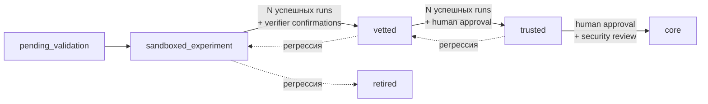
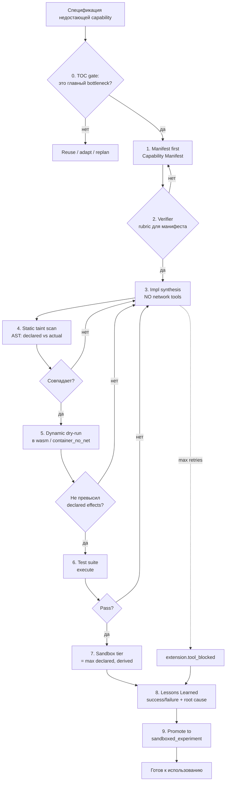

# 05 — Tool Model и ToolForge

> ← [04 — Multi-Agent Topology](./04-multi-agent-topology.md) · далее → [06 — Memory & Strategy](./06-memory-and-strategy.md)

---

## 5.1 Trust Ladder



- **pending_validation** — манифест есть, импл есть, тесты ещё не прошли.
- **sandboxed_experiment** — прошёл taint+tests; единственный tier, в который ToolForge может промоутить автономно.
- **vetted** — стабильно отработал N runs; разрешён `container_net_allowlist` tier.
- **trusted** — допущен в `container_full`; повышение требует human approval.
- **core** — допущен в `host`; только через security review человеком.
- **retired** — снят с использования (failure-score EMA превысил порог).

---

## 5.2 Capability Manifest

Манифест — **первое**, что генерирует ToolForger. До генерации кода.

```ts
type ToolKind = 'script' | 'api_client' | 'mcp_tool' | 'wasm_module';
type ToolStatus = 'pending_validation' | 'sandboxed_experiment'
                | 'vetted' | 'trusted' | 'core' | 'retired';
type SandboxTier = 'wasm' | 'container_no_net' | 'container_net_allowlist'
                 | 'container_full' | 'host';
type DeclaredEffect = 'fs.read' | 'fs.write' | 'net.out' | 'net.in'
                    | 'process.spawn' | 'env.read' | 'time';

interface ToolCapabilityManifest {
  description: string;
  triggers: string[];                       // когда применять
  inputSchema: object;                      // JSON Schema
  outputSchema: object;
  declaredEffects: DeclaredEffect[];
  requiredTrustTier: ToolStatus;
  requiredSandboxTier: SandboxTier;
  egressAllowlist?: string[];               // hostname'ы, если net.out
  fsScope?: string[];                       // path globs, если fs.*
  perCallBudget?: {
    tokensUSD?: number;
    wallMs?: number;
    egressKB?: number;
  };
}
```

---

## 5.3 RegistryEntry (полная схема)

```ts
interface RegistryEntry {
  id: string;                              // UUID v4
  name: string;                            // slug, уникален
  kind: ToolKind;
  status: ToolStatus;
  capability: ToolCapabilityManifest;
  implPath: string;                        // абсолютный путь
  contentHash: string;                     // SHA-256
  signature?: string;                      // signed provenance
  artifactId: string;                      // tool_source ArtifactRef
  testSuiteArtifactId: string;             // tool_test_suite
  lastTestResultArtifactId?: string;       // последний sandbox_result
  forgedByConceptId?: string;              // какая концепция породила
  parentToolId?: string;                   // для эволюционировавших
  version: number;
  trustHistory: Array<{
    at: string;
    from: ToolStatus;
    to: ToolStatus;
    reason: string;
    runId?: string;
  }>;
  failureScore: number;                    // EMA failure rate
  createdAt: string;
  updatedAt: string;
  retiredAt?: string;
  tags: string[];
}
```

---

## 5.3.1 M3 runtime enforcement layer

M3 adds the first runtime chokepoints before ToolForge is enabled:

- `runtime/universal/effect-gateway.ts` authorizes declared effects against the tool capability manifest (`declaredEffects`, `fsScope`, `egressAllowlist`, `perCallBudget`) and writes deterministic effect-journal lines.
- `runtime/universal/sandbox-executor.ts` provides the engine-local `ISandboxExecutor` contract and a `LocalProcessBackend` with `shell:false`, minimal env, workdir isolation, timeout kill, and output caps.
- Docker/Firecracker/container tiers stay deferred to M10; M3 only proves the contract and local execution path without adding hard dependencies.

---

## 5.3.2 M4 governance metadata on effects

M4 does not let tools decide their own autonomy tier. The engine passes `tierDecision`, `tierReasonCodes`, `decisionVectorRef`, and `requiresApproval` into `EffectGateway` alongside the capability manifest:

- `tierDecision='block'` denies the effect before manifest checks, preserving the global safety/gate/budget decision.
- Allowed and denied `EffectDecision`s preserve the same metadata for `effect_journal` and `effect.policy_decided`.
- `ApprovalFlow` requests carry `concept_id`, `engine_phase`, `decision_vector_ref`, `budget_scope`, and `budget_rule_id`, so budget and side-effect approvals can be audited against the same decision vector.

---

## 5.4 ToolForge Pipeline (обязательный порядок)



**Theory of Constraints gate:** ToolForge не запускается просто потому, что capability отсутствует. Сначала `CapabilityGapAnalysis` должен доказать, что это главный bottleneck текущего плана и что он не снимается переиспользованием, адаптером или перепланированием.

### 5.4.1 TOC-Gate Contract (обязателен до ToolForge)

`ToolForge` может стартовать только если записан и подписан следующий набор артефактов:

```ts
interface TocGateArtifactSet {
  bottleneck_proof: string;                       // доказательство, что это главный bottleneck
  reuse_analysis: string;                         // какие vetted/registry-инструменты рассмотрены
  adaptation_impossible_justification: string;    // почему адаптер/расширение не подходит
  forge_justification: string;                    // почему forge действительно снимет bottleneck
}
```

| Артефакт | Что должен доказывать |
|---|---|
| `bottleneck_proof` | Это **главное** ограничение текущего cycle, а не одно из вторичных |
| `reuse_analysis` | Какие существующие инструменты, примитивы и registry-entry были рассмотрены |
| `adaptation_impossible_justification` | Почему адаптер/расширение не решают bottleneck приемлемо и безопасно |
| `forge_justification` | Почему новый инструмент действительно снимет bottleneck и зачем он лучше replanning |

Отсутствие любого из четырёх артефактов → `ToolForge` не стартует. После 2 неуспешных ToolForge-циклов в одном run система обязана эскалировать задачу человеку через `ApprovalFlow`.

### 5.4.2 PostForge LessonsLearned (обязательно даже для адаптеров)

После каждого `ToolForge`-цикла — успешного, частично успешного или провалившегося — записывается структурированный artifact:

```ts
interface PostForgeLessonsLearned {
  scope: 'tool';
  toolCreated: string;
  bottleneckAddressed: string;
  expectedImpact: string[];
  algorithmOutcome: 'success' | 'partial' | 'failed_to_meet_criteria';
  doubleLoopTrigger?:
    | 'forge_failed_twice'
    | 'taint_regression'
    | 'reuse_rule_gap'
    | 'budget_policy_gap';
  governanceAdjustmentProposal?: string;
  evidenceRefs: string[];
}
```

Обязательные поля для v1: `toolCreated`, `bottleneckAddressed`, `expectedImpact`, `algorithmOutcome`, `evidenceRefs`. Если заполнен `doubleLoopTrigger`, поле `governanceAdjustmentProposal` становится обязательным. Активация proposal проходит через `ApprovalFlow` (см. 0.5.2.1).

### 5.4.3 Ограничение v1 на синтез

- Не более **2** новых executable-инструментов (`non-adapter`) за один `concept_run`. Лимит вешается на `parentConceptId`/run lineage, чтобы concept-splitting не обходил правило.
- В лимит входят **distinct new executable capabilities**, идентифицируемые стабильным `capabilityFingerprint = hash(manifest.capability + sorted(manifest.declaredEffects) + manifest.inputSchemaHash + manifest.outputSchemaHash)`. Ретраи и патчи того же fingerprint не считаются.
- Адаптеры и manifest-only entries в лимит не входят, но всё равно обязаны проходить `TOC-Gate` и `PostForge LessonsLearned`.
- Soft cap = 2; hard cap = 3 разрешается только через `ApprovalFlow`. Approval привязывается к **конкретному** `capabilityFingerprint` — нельзя получить «бланк» на третий слот.
- Попытка превысить лимит вне approval приводит к `replan` или `block` (по умолчанию — human escalation).

### 5.4.4 Lineage-scoped enforcement (preflight + commit)

`token-budget-controller.toolCreationSlots` — это **lineage-scoped структурная квота**, не fungible бюджет. Учёт идёт по событиям EventLedger, не по mutable registry view:

1. **Preflight** перед `dag.node.started` для ToolForge: orchestrator резервирует слот через `tool.slot.reserved {parentConceptId, capabilityFingerprint}`.
2. **Commit** при первой промоции в `pending_validation` или `sandboxed_experiment`: `tool.slot.committed`. Без commit-события слот возвращается reservation-TTL.
3. **Release** при отказе/eviction до commit: `tool.slot.released`.
4. **Concurrency**: два конкурирующих ToolForge на одной lineage сериализуются по `parentConceptId`; одновременная reservation одинакового fingerprint = noop.
5. **Replay**: текущее состояние слотов выводится только из событий, регистр — производное представление.

**Приоритет vs другие сигналы:** TOC-Gate failure побеждает `tool_cap_exhausted`; safety_block побеждает оба.

---**Lessons Learned (общая запись):** каждый ToolForge cycle создаёт `lessons_learned` artifact: `whatWorked`, `whatFailed`, `rootCause`, `algorithmOutcome`, `bottleneckAddressed`, `toolDelta`, `policyProposal`, `evidenceRefs`, `confidence`. Уроки с низкой confidence не попадают в активную Strategy Memory.

---

## 5.5 Sandbox Tiers

| Tier | Что разрешено | Кому |
|---|---|---|
| `wasm` | чистые вычисления, syscalls только через декларированные imports | любой инструмент |
| `container_no_net` | fs read/write в `fsScope`, никакой сети | `pending_validation+` |
| `container_net_allowlist` | + outbound только на `egressAllowlist` | `vetted+` |
| `container_full` | full network | `trusted+` |
| `host` | host execution | `core` + per-run human approval |

Tier для каждого вызова = `max(manifest.requiredSandboxTier, derived(declaredEffects))`. **Понизить нельзя.**

---

## 5.6 Effect Gateway

Единственный chokepoint для всех side effects — `runtime/universal/effect-gateway.ts`. Любой вызов из инструмента в OS / сеть / FS проходит через него.

**Проверки на каждом вызове:**
1. tool разрешён на этот tier?
2. эффект `e` ∈ `declaredEffects`?
3. для `fs.*` — путь ∈ `fsScope`?
4. для `net.out` — host ∈ `egressAllowlist`?
5. per-call budget не превышен (`tokensUSD`, `wallMs`, `egressKB`)?
6. per-tool budget cap (за концепцию) не превышен?

При нарушении — **kill** инструмента, событие `effect.violation`, инкремент `failureScore`.

Все проходящие effects пишутся в `effect_journal` артефакт (jsonl).

---

## 5.7 Failure-Score Eviction

- Каждый успешный/неудачный run обновляет EMA `failureScore`.
- При превышении порога `evictionThreshold` (конфигурируемого per kind) → автоматическая демотация на 1 tier вниз + событие `tool.demoted`.
- Повторная регрессия → `retired`.
- Retired инструменты остаются в registry для аудита, но не выбираются Discovery.

---

## 5.8 ToolRegistry API

```ts
interface ToolRegistry {
  register(entry: Omit<RegistryEntry, 'id'|'createdAt'|'updatedAt'|'version'>): RegistryEntry;
  find(query: { kind?: ToolKind; status?: ToolStatus; tags?: string[]; q?: string }): RegistryEntry[];
  get(id: string): RegistryEntry | undefined;
  getByName(name: string): RegistryEntry | undefined;
  promote(id: string, to: ToolStatus, reason: string): RegistryEntry;
  demote(id: string, to: ToolStatus, reason: string): RegistryEntry;
  retire(id: string): boolean;
  loadAll(): RegistryEntry[];
}
```

Backing store: `~/.pyrfor/tool-registry.jsonl` (append-only). Дедупликация по `contentHash` — повторная регистрация эквивалентного импла → возвращает существующий entry с инкрементом `version`.
