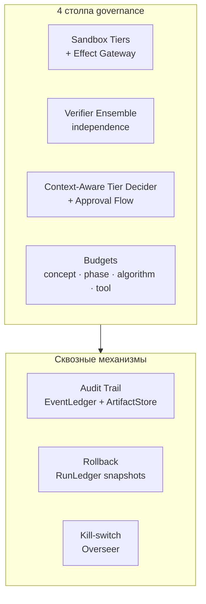
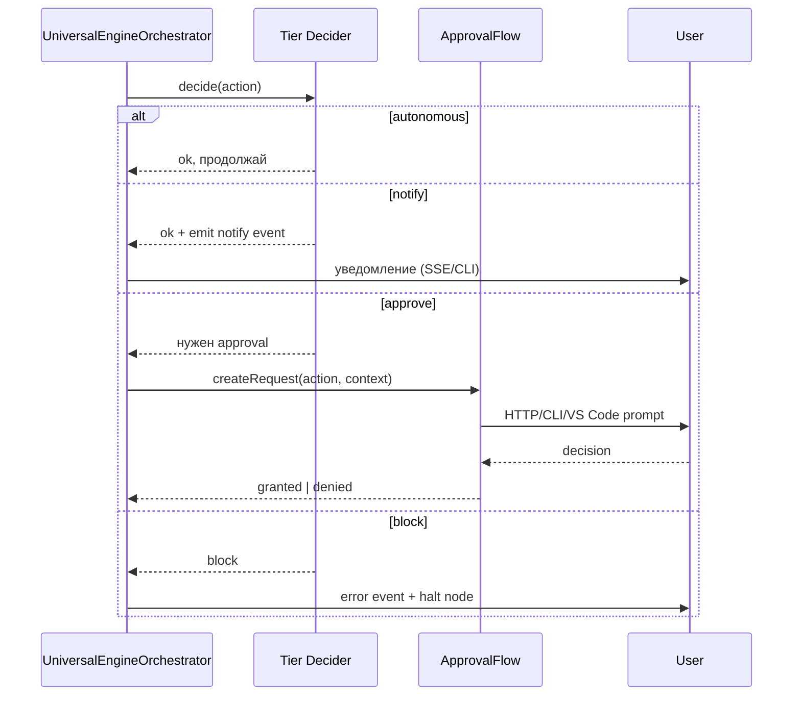
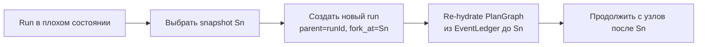

# 07 — Безопасность и Governance

> ← [06 — Memory & Strategy](./06-memory-and-strategy.md) · далее → [08 — Multi-Model Policy](./08-multi-model-policy.md)

---

## 7.1 Принцип governance

Безопасность Universal Engine стоит на **четырёх столпах**:



---

## 7.2 Sandbox Tiers (повторно, для удобства)

| Tier | Allowed | Required tool status |
|---|---|---|
| `wasm` | pure compute + declared imports | any |
| `container_no_net` | fs read/write в `fsScope` | `pending_validation+` |
| `container_net_allowlist` | + outbound на `egressAllowlist` | `vetted+` |
| `container_full` | full network | `trusted+` |
| `host` | host execution | `core` + per-run approval |

Никогда не понижаем — реальный tier = `max(declared, derived)`.

---

## 7.3 Context-Aware Tier Decider (детерминированная функция)

Чистая функция в `runtime/universal/tier-decider.ts`. **Никаких LLM в loop'е.** Context-aware означает, что функция учитывает фазу, управляющий алгоритм и decision-vector, но остаётся полностью детерминированной и unit-tested.

```ts
type TierDecision = 'autonomous' | 'notify' | 'approve' | 'block';
```

**Формальный `decision_vector` для аудита и решения:**

```ts
interface DecisionVector {
  phase: string;
  governedAlgorithm:
    | 'strategic_planning'
    | 'research_tool_creation'
    | 'execution_quality_control'
    | 'lessons_learned'
    | 'system_self_improvement';
  reversibility: 'reversible' | 'partial' | 'irreversible';
  sandboxTier: string;
  toolTrustTier: string;
  failureHistoryScore: number;
  estimatedImpact: { fsScope: string[]; netReach: string[]; moneyUsd: number };
  remainingBudget: { tokens?: number; usd?: number; wallMs?: number };
  loopCount: number;
  newEvidencePresent: boolean;
  gateStatus: 'satisfied' | 'partial' | 'failed';
  algorithmCoverage: 'declared' | 'inferred' | 'grandfathered';
  toolCapRemaining: number;                // executable-tool slots на concept_run
}
```

`decision_vector` хранится как artifact kind `decision_vector`; `EffectGateway`, `ApprovalFlow` и `effect.policy_decided` несут `decision_vector_ref` и `reason_codes`, чтобы один и тот же вход объяснял решение, approval и effect journal.

**Порядок приоритетов решения:** `safety block` > `gate failed` > `tool cap exhausted` > `budget exhausted abort` > `approve` > `notify` > `autonomous`. Алгоритм не может понизить safety; hard budget exhaustion останавливает новый loop и одновременно помечает, что нужен approval на расширение бюджета.

**Правила (упрощённо):**
- `block` если: safety block (`sandboxTier='forbidden'` или `toolTrustTier='retired'`), failed gate, exhausted ToolForge cap или hard budget exhaustion.
- `approve` если: budget extension is required, effect irreversible, gate partial, privileged sandbox tier, low tool trust, money impact, or grandfathered coverage.
- `approve` если: self-improvement phase или retry без нового evidence.
- `notify` если: inferred algorithm coverage, retry loop, moderate failure history, fs scope or network scope need operator visibility but not approval.
- `autonomous` иначе.

Каждое решение возвращает `TierDeciderResult { decision, reasonCodes, requiresApproval, abortRequired }`, что предотвращает "магические" approvals без machine-readable причины.

---

## 7.4 Approval Flow



---

## 7.5 Бюджеты

Четыре уровня (все через расширенный `token-budget-controller.ts`):

1. **Per-concept** — общий лимит на одну концепцию (tokens, USD, wallMs).
2. **Per-phase** — лимит на каждую фазу lifecycle (защита от застревания).
3. **Per-algorithm** — лимит на Strategic Planning / Research+ToolCreation / Execution+QualityControl / LessonsLearned / SystemSelfImprovement.
4. **Per-tool** — `manifest.perCallBudget` × счётчик вызовов за концепцию.

M4 добавляет runtime-attribution поля прямо в `BudgetRule`, `ConsumeRequest` и `Consumption`: `targetId` (concept/session/task id), `phaseId`, `algorithm`, `toolName`. Это позволяет одной и той же функции `canConsume()` закрывать per-concept, per-phase, per-algorithm и per-tool лимиты без отдельного бюджетного движка.

При истощении:
- soft-порог (80%) → `notify`.
- hard-порог (100%) → `block`/abort на уровне TierDecider и отдельный `ApprovalFlow` запрос на доп. бюджет; deny → `concept.failed`.

---

## 7.6 Audit Trail

Каждое действие фиксируется минимум в одном месте:

| Тип действия | Где |
|---|---|
| Любое решение агента | EventLedger (`*.started`, `*.completed`) |
| Артефакт | ArtifactStore (content-addressed → неизменяем) |
| Approval-решение | ApprovalFlow store + EventLedger |
| Memory write | MemoryStore + EventLedger (`strategy.set` и т.п.) |
| Algorithmic checkpoint / lesson | ArtifactStore (`algorithm_outcome`, `lessons_learned`) + EventLedger |
| Effect (fs/net/process) | `effect_journal` артефакт |
| Snapshot | RunLedger |

### 7.6.1 Обязательные governance-артефакты для consequential nodes

| Артефакт | Когда пишется | Минимум полей |
|---|---|---|
| `decision_record` | до старта consequential node | `nodeHash`, `alternativesConsidered`, `selectedAlternative`, `evidenceRefs`, `rationale`, `budgetImpact` |
| `completion_gate_report` | при закрытии цикла | `requiredArtifacts`, `successCriteria`, `missingArtifacts[]`, `status` |
| `feedback_stop_report` | при остановке feedback loop | `maxLoops`, `actualLoops`, `stopArtifactKind`, `stopReason`, `escalationTrigger?` |
| `toolforge_cycle_report` | при stop/escalation в ToolForge | `tocGatePassed`, `attemptCount`, `newToolsCreated`, `toolCapRemaining`, `escalated` |

Без этих артефактов consequential node не считается аудируемым и не может получить статус `completed`. Audit-инвариант: нет `*.started` без предшествующего `decision_record` для consequential node.

### 7.6.2 Tool-cap ↔ Budget Controller

В `token-budget-controller.ts` добавляется счётчик `toolCreationSlots` (per-concept lineage). Слот **резервируется** при старте ToolForge (`tool.slot.reserved`) и **списывается** только при commit-событии `tool.slot.committed` в момент первой промоции в `pending_validation/sandboxed_experiment`. Дедупликация — по `capabilityFingerprint`. Адаптеры и retry того же fingerprint — вне слота. Soft cap = 2, hard cap = 3 только через `ApprovalFlow`, привязанный к конкретному fingerprint. Изменение cap само является `governance_adjustment_proposal` и требует human-tier.

### 7.6.3 Orchestrator governance hook

`UniversalEngineOrchestrator` обязан реализовать `UniversalEngineOrchestratorGovernanceHook.beforeNodeComplete()` (см. [00.5.8](./00.5-algorithmic-governance.md#058-enforcement-completion-gate-engine)). В M1 hook уже живёт в `DurableDagOptions.beforeNodeComplete` (`packages/engine/src/runtime/durable-dag.ts`) и вызывается синхронно внутри `DurableDag.completeNode()` до записи `dag.node.completed`. Hook вызывает `CompletionGateEngine` (`packages/engine/src/runtime/universal/completion-gate-engine.ts`) и возвращает один из четырёх вердиктов: `allow_complete | await_new_evidence | escalate_approval | block_terminal`. Транзишн в `dag.node.completed` возможен только при `allow_complete`.

**Admission vs completion gates** различаются по `gate_kind` в `GateCheckEvent` и имеют независимые `attempt`-счётчики. Один узел может пройти admission и провалить completion (типичный случай ToolForge: TOC-Gate ok → синтез провален → completion gate отклонён).

### 7.6.4 Never-grandfathered safety gates

Следующие гейты **никогда** не могут быть waived через approval или обойдены через `GrandfatheringScope.bypasses`:

- `unsafe_intent_block`
- `declared_effects_enforcement`
- `sandbox_tier_assignment`
- `taint_scan` (статический и динамический)
- `prompt_injection_scan`
- `approval_for_policy_change`
- `approval_for_budget_change`
- `kill_switch`

Попытка эмитить `governance.gate.checked` с `disposition='waived_by_approval'` для одного из этих `gate_id` — `safety_block` + ledger violation event. Список фиксирован в коде `tier-decider.ts` и меняется только через `governance_adjustment_proposal` высшего tier.

### 7.6.5 DecisionRecord poisoning protection

Применяется модель **canonical record + suspicion score** (см. [00.5.11](./00.5-algorithmic-governance.md#0511-decisionrecord-poisoning-canonical--suspicion-signals)):

- На один `(nodeId, attempt)` — **один** канонический `DecisionRecord`. Дополнительные допустимы только как `superseding` цепочка с новым evidence до `dag.node.started`.
- Подозрительные дополнения помещаются в `quarantine` и не блокируют узел при наличии валидного canonical.
- Отсутствие/невалидность canonical → `gate_failed (decision_record_invalid)`.
- `conflicting_same_node_hash` с двумя «authoritative» canonical-кандидатами → `safety_block`, не gate_failed.
- Сигналы (`duplicate_evidence_set`, `near_duplicate_rationale`, `low_rationale_entropy`, `budget_inflation_without_new_evidence`, `out_of_sequence_write`, `excessive_records_without_progress`) рассчитываются `decision-record-auditor.ts` (детерминированно, без LLM) и логируются в `decision_record_audit` artifact.

**M1 scoring algorithm:** `packages/engine/src/runtime/universal/decision-record-auditor.ts` считает weighted suspicion score:

| Signal | Weight | Rule |
|---|---:|---|
| `duplicate_evidence_set` | 0.18 | same sorted `evidenceRefs` hash reused in same `(nodeId, attempt)` |
| `near_duplicate_rationale` | 0.16 | Jaccard token similarity ≥ 0.88 with peer rationale |
| `low_rationale_entropy` | 0.12 | unique-token ratio < 0.32 |
| `budget_inflation_without_new_evidence` | 0.20 | budget score grows >25% while evidence hash unchanged |
| `out_of_sequence_write` | 0.24 | record timestamp is after `dag.node.started` without supersession |
| `excessive_records_without_progress` | 0.18 | ≥5 records for same attempt without progress events |
| `conflicting_same_node_hash` | 1.00 | same `nodeHash`, different selected alternative, both canonical candidates → `safety_block` |

### 7.6.6 Verifier retry budget — scope

`verifierRetryBudget` (1–2 на узел) применяется **только** к классам `verifier_disagreement` и `external_dependency_failed`. Он не покрывает `gate_failed`, `safety_block`, `tool_cap_exhausted`, `decision_record_invalid` — для них требуется новая evidence (через retryable gate) или approval/escalation.

---

## 7.7 Rollback



- Snapshot создаётся на каждой границе фазы.
- ArtifactStore content-addressed → артефакты переиспользуются автоматически.
- Старый run не удаляется (audit), но помечается `superseded_by=newRunId`.

---

## 7.8 Kill-Switch

Overseer мониторит:
- общий бюджет всех активных concepts,
- circuit-router health (% ошибок провайдера),
- длину очереди EventLedger,
- частоту `effect.violation` событий.

При пересечении threshold'ов:
1. **Soft kill** — приостанавливает приём новых концепций.
2. **Hard kill** — приостанавливает текущие узлы (с возможностью resume) + `approval` на разблокировку.
3. Все срабатывания — на EventLedger.

---

## 7.9 Защита от prompt-injection

- **Researcher output** → injection-scan verifier (rubric: «есть ли в источнике инструкции для агента?»).
- **Web content** рендерится Planner'у как **цитируемое evidence с source URL**, а не как инструкции.
- **Tool synthesis no-net rule:** при генерации кода у ToolForger нет сетевых инструментов — модель не может «втянуть» инъектированный контент в момент написания кода.
- **MCP-инструменты** проходят отдельный manifest review перед регистрацией.

---

## 7.10 Чеклист безопасности перед релизом фичи

- [ ] Все новые операции имеют tier-decider маппинг.
- [ ] Все consequential operations пишут `decision_vector`.
- [ ] Каждый consequential node пишет валидный `DecisionRecord` **до** выполнения узла (с `nodeHash` и `evidenceRefs`).
- [ ] Для каждой completion gate перечислены обязательные артефакты и поведение при их отсутствии.
- [ ] Каждый feedback loop имеет `FeedbackLoopContract`, `stopArtifactKind` и явный `stopReason`; budget exhaustion имеет приоритет над `max_loops`.
- [ ] ToolForge хранит 4 артефакта `TOC-Gate`, `PostForge LessonsLearned` и соблюдает лимит v1: max 2 новых executable non-adapter tools на `concept_run`.
- [ ] Для legacy nodes установлен `algorithmCoverage: grandfathered` с дефолтным маппингом по фазе и логированием `governance.legacy_node`.
- [ ] Все новые tool-эффекты декларированы в манифесте.
- [ ] Все новые артефакты имеют ArtifactKind с retention policy.
- [ ] Все новые события на EventLedger типизированы.
- [ ] Все новые feedback loops имеют `max_loops` и requires-new-evidence правило.
- [ ] Snapshot покрывает новую фазу (если добавлена).
- [ ] Rollback тест проходит для нового сценария.
- [ ] Зависимости от FreeClaude execution mode не нарушены (regression suite зелёная).
