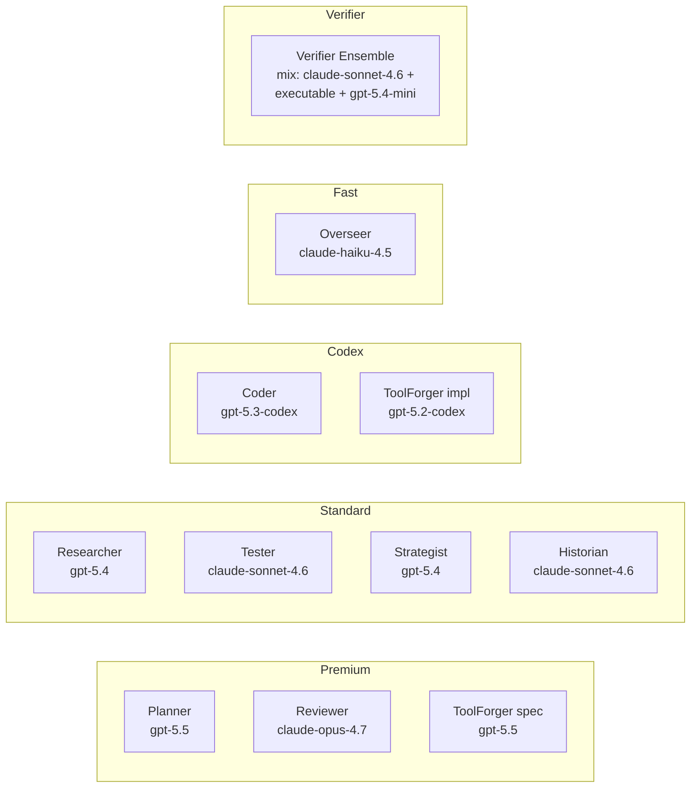

# 08 — Multi-Model Policy

> ← [07 — Safety & Governance](./07-safety-and-governance.md) · далее → [09 — API · CLI · VS Code](./09-api-cli-vscode.md)

---

## 8.1 Классы моделей

| Класс | Примеры | Использование |
|---|---|---|
| **Premium** | `gpt-5.5`, `claude-opus-4.7` | Planner (первый план), Reviewer, ToolForger spec phase, Verifier для high-impact узлов |
| **Standard** | `gpt-5.4`, `claude-sonnet-4.6`, `gpt-5.2` | Researcher, Tester, Strategist, Historian |
| **Standard codex** | `gpt-5.3-codex`, `gpt-5.2-codex` | Coder, ToolForger impl phase |
| **Fast** | `claude-haiku-4.5`, `gpt-5.4-mini`, `gpt-4.1` | Overseer, schema validation, status updates, quick LLM-judge верификации |

---

## 8.2 Распределение по агентам (default)



---

## 8.3 Правила distribution

1. **Verifier independence:** Verifier ensemble на узле должен включать минимум одну модель из **другого семейства**, чем агент-производитель узла.
   - Producer = `gpt-5.3-codex` (OpenAI) → Verifier должен включать Claude или executable.
   - Producer = `claude-opus-4.7` → Verifier должен включать GPT или executable.
2. **Executable verifier обязателен** на консеквентных узлах.
3. **Strategist никогда не = Planner** (разные роли, разные context'ы; обычно одного класса, но разных instance'ов).
4. **Reviewer ≠ Planner** на одном узле (избегаем confirmation bias).

**M5 runtime cap:** `runtime/universal/critic.ts` accepts only verifier models at or below `gpt-5.4` / `claude-sonnet-4.6` (`gpt-5.4`, `gpt-5.2`, `gpt-5.4-mini`, `gpt-4.1`, `gpt-5.3-codex`, `gpt-5.2-codex`, `claude-sonnet-4.6`, `claude-haiku-4.5`) plus `executable` verifiers. Premium verifier models are rejected at family-resolution time until an explicit human-tier policy change.

---

## 8.4 Failover через circuit router

`runtime/pyrfor-fc-circuit-router.ts` (существующий, переиспользуем) обрабатывает:
- Provider outage → fallback на следующий по приоритету.
- Rate-limit → ожидание + fallback.
- Error rate > threshold → automatic open circuit.

**Дополнительное правило для Universal Engine:**
- При failover **сохраняется family-diversity rule** verifier ensemble. Если fallback нарушит правило → escalate как `approval` (lieu выполнения с одним verifier'ом).

---

## 8.5 Budget-Aware Downgrade

При остатке концептуального бюджета < threshold (по умолчанию 30%):

| Агент | Default | Downgrade до |
|---|---|---|
| Planner | premium | standard |
| Researcher | standard | fast |
| ToolForger spec | premium | standard |
| ToolForger impl | codex | smaller codex |
| Coder | codex | smaller codex |
| Tester | standard | fast |
| Reviewer | premium | standard |
| **Verifier** | **mix** | **НЕ ДОУНГРЕЙДИМ** |
| Historian | standard | fast |
| Overseer | fast | fast (без изменений) |

**Verifier никогда не downgrade'ится** — иначе подрываем основу governance.

---

## 8.6 Конфигурация

`~/.pyrfor/model-policy.json`:

```json
{
  "agents": {
    "planner":   { "default": "gpt-5.5",          "downgrade": "gpt-5.4" },
    "researcher":{ "default": "gpt-5.4",          "downgrade": "gpt-5.4-mini" },
    "tool_forger_spec": { "default": "gpt-5.5",   "downgrade": "claude-sonnet-4.6" },
    "tool_forger_impl": { "default": "gpt-5.3-codex", "downgrade": "gpt-5.2-codex" },
    "coder":     { "default": "gpt-5.3-codex",    "downgrade": "gpt-5.2-codex" },
    "tester":    { "default": "claude-sonnet-4.6","downgrade": "claude-haiku-4.5" },
    "reviewer":  { "default": "claude-opus-4.7",  "downgrade": "claude-sonnet-4.6" },
    "strategist":{ "default": "gpt-5.4",          "downgrade": "gpt-5.4-mini" },
    "historian": { "default": "claude-sonnet-4.6","downgrade": "claude-haiku-4.5" },
    "overseer":  { "default": "claude-haiku-4.5", "downgrade": "claude-haiku-4.5" }
  },
  "verifier_ensemble": {
    "min_size": 2,
    "require_executable": true,
    "family_diversity": true,
    "downgrade_allowed": false
  },
  "budget_downgrade_threshold": 0.3
}
```

Изменение этого файла — human-tier через approval-flow.

---

## 8.7 Метрика "model effectiveness"

Historian после PostMortem пишет в semantic memory статистику:
- per-agent pass-rate по моделям,
- средняя стоимость узла,
- частота rework по моделям.

Эти данные становятся основой для предложений Meta-Critic в M15 (например, «для kind X понизить Planner до standard — 0 регрессий за N runs»).
