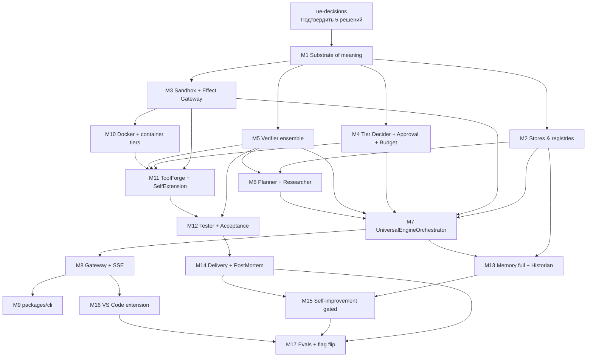

# 10 — Roadmap & Milestones

> ← [09 — API · CLI · VS Code](./09-api-cli-vscode.md) · далее → [11 — Prior Art](./11-prior-art.md)

---

## 10.1 Принципы порядка

1. **Safety first.** Substrate of meaning + Verification + Governance — раньше любого ToolForge.
2. **Аддитивность.** Каждый milestone компилируется на чистом дереве; FreeClaude путь не трогаем.
3. **Feature-flag.** Всё за `features.universalEngine` до M17.
4. **Без оценок времени.** Только зависимости и acceptance.
5. **Algorithmic governance early.** Контракты `governedByAlgorithm`, checkpoint policy, completion criteria и feedback policy появляются в M1, чтобы все следующие milestone строились поверх них.

---

## 10.2 Граф зависимостей

---

## 10.3 Milestones

| # | Название | Главные файлы | Acceptance |
|---|---|---|---|
| **M1** | Substrate of meaning + enforcement ownership | `runtime/universal/{completion-gate-engine,decision-record-auditor,legacy-node-auditor,historian}.ts`; `runtime/universal/memory/{provider,types,algorithm-aware-retriever,strategy-memory-provider,context-engine}.ts`; расширения `event-ledger.ts`, `artifact-model.ts`, `durable-dag.ts` | tsc clean; targeted tests зелёные; `beforeNodeComplete` blocks missing artifacts before `dag.node.completed`; DecisionRecord scorer deterministic; legacy audit and memory v2 contracts exported; ноль регрессий |
| **M2** | Stores & registries + Memory read-path | `runtime/universal/memory/{concept-store,strategy-store,memory-facade}.ts`; `runtime/universal/tool-registry.ts`; `guardrails.ts` (sandbox tier) | unit-тесты pass; `ConceptStore` project/cross-concept scope works; `StrategyStore` approved-only project isolation works; `ToolRegistry` persists/dedupes/retires append-only entries; `UniversalMemoryFacade` returns approved-only non-legacy lessons; sandbox tier enforced |
| **M3** | Effect Gateway + Sandbox + minimal ContextEngine compressors | `runtime/universal/{sandbox-executor,effect-gateway,docker-sandbox-backend,wasm-sandbox-backend}.ts`; `runtime/universal/memory/context-engine.ts`; later `packages/sandbox/` extraction | LocalProcess pass; factory dispatches local/wasm/docker backends; Docker/Wasm run paths explicitly deferred; EffectGateway enforces manifest effects/scope/budgets; engine без hard-dep на dockerode; deterministic bounded compressors pass |
| **M4** | Tier Decider + Approval + Budget | `runtime/universal/tier-decider.ts`; `approval-flow.ts`; `token-budget-controller.ts`; `effect-gateway.ts`; `event-ledger.ts`; `artifact-model.ts` | context-aware deterministic decisions unit-tested; `decision_vector` artifact kind exists; EffectGateway/ApprovalFlow/EventLedger carry decision-vector refs and reason codes; concept/phase/algorithm/tool budget attribution works; hard budget exhaustion → abort + approval path; no LLM in decider |
| **M5** | Verifier ensemble | `runtime/verifier-lane.ts` (extend); `runtime/universal/critic.ts` | ≥2 верификатора; family-diversity fail-fast before verifier calls; executable verifier required by default; deterministic quorum (`block > rework > pass`); «Critic agrees with Coder» test pass; verifier models capped at `gpt-5.4` / `claude-sonnet-4.6` |
| **M6** | Planner + Researcher | `runtime/universal/{concept-clarifier,planner,researcher}.ts`; `ai/orchestration/{planner,universal-planner}.ts` | plan idempotency; bounded clarification loop that never blocks non-interactive runs; injection-scan before planning; bounded lookahead guards (`maxBranches`, `maxDepth`, `maxBacktracks`, `requiresNewEvidence`); OODA research loop bounded; offline-fallback Researcher; no ToolForge/gateway/orchestrator wiring |
| **M7** | UniversalEngineOrchestrator | `runtime/universal/{engine-loop,index}.ts`; `runtime/index.ts` | Implemented: minimal `UniversalEngineOrchestrator` drives `plan → research? → execute → critique → done` with injectable runners, durable DAG rehydration, resume-from-node without re-planning, rollback compensators, abort handling, runtime `startUniversalEngine()` / `dispatchConcept()`, and targeted tests |
| **M8** | Gateway + SSE | `runtime/{gateway,config}.ts` + tests | Implemented: feature-flagged `/api/concepts` REST surface, concept detail/plan/phases/abort routes, concept-scoped SSE over EventLedger, sanitized artifact refs, and 503 guard when `features.universalEngine` or orchestration support is absent |
| **M9** | packages/cli | `packages/cli/`; `pnpm-workspace.yaml` | Implemented: standalone `@pyrfor/cli` package for `concept`, `plan`, `status`, and `abort` commands over the M8 gateway, with JSON/human output, gateway URL/token options, dry-run planning alias, and mocked-fetch unit tests; existing engine chat/telegram CLI remains untouched |
| **M10** | Docker + container tiers | `runtime/universal/{sandbox-executor,docker-sandbox-backend}.ts` | Implemented: tier-aware Docker backend without dockerode, `container_no_net` / `container_net_allowlist` / `container_full` executor selection, deterministic Docker run spec generation, workdir-bound mount safety, conservative no-network allowlist tier with pre-run egress validation, and injectable runner tests |
| **M11** | ToolForge + SelfExtension | `runtime/universal/{tool-forge,self-extension-loop,tool-slot-manager}.ts` | Implemented: safe manifest-first ToolForge skeleton with TOC artifact gate, reuse/adapt/forge decision, mandatory static-analysis and dynamic-test evidence, network/privileged-sandbox validation, ToolForge lesson document, sandbox-only registration as `sandboxed_experiment`, regression eviction helper, lineage-scoped `tool.slot.*` reservation/commit/release manager, and `SelfExtensionLoop` facade |
| **M12** | Tester + AcceptanceVerification | `runtime/universal/tester.ts`; интеграция с critic | тесты исполняемые; verification report shape; bounded rework |
| **M13** | Memory full + Historian | `runtime/universal/historian.ts`; `memory-facade.ts` extended | provenance на каждой записи; conflict → approval, не overwrite; double-loop lesson candidates quarantine/promote correctly |
| **M14** | DeliveryPackager + PostMortem | `runtime/universal/{delivery,postmortem}.ts` | manifest+checksum bundle; postmortem артефакт |
| **M15** | Self-improvement gated | `runtime/universal/meta-critic.ts` | algorithm-specific improvement proposals only; policy changes always human-tier; eval proof + rollback verified |
| **M16** | VS Code extension surface | extension package | tree views live; SSE trace renders; команды работают |
| **M17** | Evals + flag flip | `evals/universal-engine-evals.ts` | deterministic evals pass; full tsc clean; ноль FreeClaude регрессий; flip default `true` |

---

## 10.4 Migration discipline

- Каждый M аддитивен. Если M ломает существующий тест — это **bug**, переделываем.
- Все новые union-members в типах помечаем как optional там, где это не нарушает invariants.
- Все новые gateway routes — за `if (!deps.universalEngine) return 503`.
- Gateway/SSE routes remain feature-flag guarded in M8; the M7 in-process `PyrforRuntime.startUniversalEngine()` / `dispatchConcept()` surface is available once runtime orchestration is initialized.
- `packages/sandbox` подключается через `await import()` — никаких синхронных require в `engine`.

---

## 10.5 Definition of Done на каждый M

1. ✅ Tsc проходит на всём монорепо.
2. ✅ Новые unit-тесты добавлены и зелёные.
3. ✅ Существующая FreeClaude regression suite зелёная.
4. ✅ Новые гардрейлы покрыты тестами (sandbox tier / verifier independence / tier decider — где применимо).
5. ✅ Документация в `docs/universal-engine/` обновлена (если изменены контракты).
6. ✅ Аудит-чеклист безопасности (см. [07.10](./07-safety-and-governance.md#710-чеклист-безопасности-перед-релизом-фичи)) пройден для затронутых поверхностей.
7. ✅ Memory changes prove approved-only retrieval, provenance, project isolation, and no raw/quarantined/rejected/legacy lesson injection into Planner/ToolForger.
8. ✅ Planning/search changes prove boundedness (`maxBranches`, `maxDepth`, `maxBacktracks`, `requiresNewEvidence`) before any lookahead/backtracking is enabled.
9. ✅ Cost-aware changes update `DecisionRecord.budgetImpact` and branch-pruning rationale; hard limits stay in TierDecider/BudgetController.
